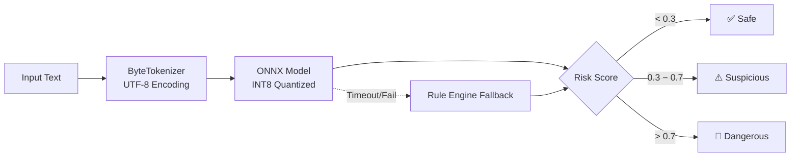
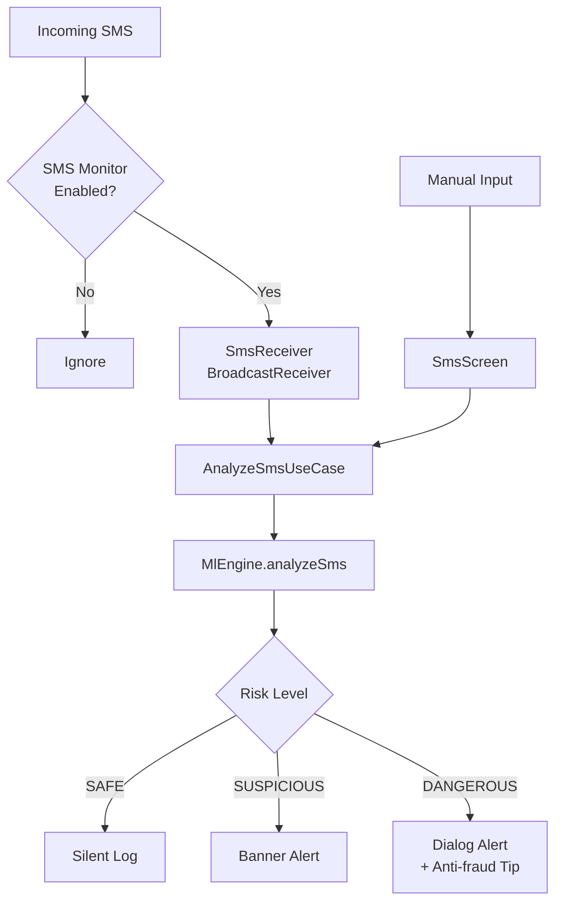

# TianshangGuard (天殇·破妄)

> **If even one person can be saved from fraud, this project is worth it.**

[](https://github.com/Tianshang301/TianshangGuard/actions)
[](LICENSE)
[](https://developer.android.com/about/versions/oreo)
[](https://kotlinlang.org)

Open-source Android anti-fraud tool with a layered defense architecture. **All analysis runs on-device — zero data upload.**

[中文文档](README.zh-CN.md)

---

## Features

| Feature | Description |
|---------|-------------|
| **DNS Domain Blocking** | Bloom Filter fast filtering + homograph detection (Punycode/Cyrillic/fullwidth) |
| **URL Phishing Detection** | Byte-level Transformer on-device inference (ONNX Runtime) |
| **SMS Scam Detection** | Manual paste analysis + BroadcastReceiver real-time interception |
| **Behavior Monitoring** | Screen sharing + banking app combination detection |
| **Tiered Alerts** | Silent log → Banner → Dialog confirmation → Full-screen block |
| **Rule Updates** | Remote blacklist/whitelist sync, community contributions |

---

## Architecture


### ML Inference Pipeline



### SMS Detection Flow



---

## Quick Start

### Requirements

- **JDK**: 17
- **Android SDK**: 35 (compileSdk)
- **Gradle**: 8.x (wrapper included)
- **Device**: Android 8.0+ (API 26)

### Build

```bash
# Clone repository
git clone https://github.com/Tianshang301/TianshangGuard.git
cd TianshangGuard

# Build Chinese version
./gradlew assembleZhRelease

# Build English version
./gradlew assembleEnRelease

# Install to device
adb install app/build/outputs/apk/zh/release/app-zh-release-unsigned.apk
```

### Downloads

| Version | Language | Models Included | Size |
|---------|----------|-----------------|------|
| [v1.0.0-chinese](https://github.com/Tianshang301/TianshangGuard/releases/tag/v1.0.0-chinese) | Chinese UI | URL + Chinese SMS | ~19 MB |
| [v1.0.0-english](https://github.com/Tianshang301/TianshangGuard/releases/tag/v1.0.0-english) | English UI | URL + English SMS | ~19 MB |

---

## Model Training

The project includes three BytePhishingTransformer models:

| Model | Dataset | Parameters | ONNX Size |
|-------|---------|------------|-----------|
| URL Detection | PhiUSIIL (235K samples) | 120,321 | 312 KB |
| Chinese SMS | ChiFraud + Synthetic | 644,865 | 1021 KB |
| English SMS | UCI + NCSU + IMC25 + Synthetic | 120,321 | 312 KB |

### Hyperparameters

| Parameter | URL Model | Chinese Model | English Model |
|-----------|-----------|---------------|---------------|
| d_model | 64 | 128 | 64 |
| n_heads | 2 | 4 | 2 |
| n_layers | 2 | 4 | 2 |
| d_ff | 128 | 256 | 128 |
| max_seq_len | 512 | 512 | 512 |
| vocab_size | 256 | 256 | 256 |

### Training Commands

```bash
cd scripts

# Train URL model
python train_phishing_model.py --mode url

# Train Chinese model
python train_phishing_model.py --mode chinese

# Train English model
python train_phishing_model.py --mode english
```

Models are automatically exported as ONNX INT8 quantized and copied to `app/src/main/assets/model/`.

### Evaluation

```bash
# Validate ONNX inference
python test_onnx_models.py

# Overfitting check
python check_fitting.py
```

---

## Project Structure

```
TianshangGuard/
├── app/src/
│   ├── main/
│   │   ├── java/com/tianshang/guard/
│   │   │   ├── core/
│   │   │   │   ├── dns/          # DNS engine, homograph detection, Bloom Filter
│   │   │   │   ├── ml/           # MlEngine, OnnxMlEngine, rule engine
│   │   │   │   ├── monitor/      # Behavior monitoring (screen sharing)
│   │   │   │   ├── alert/        # Tiered alert engine
│   │   │   │   └── telemetry/    # Performance tracing
│   │   │   ├── data/
│   │   │   │   ├── local/        # Room DB, encrypted storage, preferences
│   │   │   │   ├── remote/       # GitHub rules API
│   │   │   │   └── repository/   # Data repositories
│   │   │   ├── domain/           # UseCase layer
│   │   │   ├── service/          # VPN, foreground service, SMS receiver, boot
│   │   │   ├── ui/               # Compose UI (home, sms, stats, settings, alerts)
│   │   │   └── di/               # Koin dependency injection
│   │   └── assets/
│   │       ├── model/            # ONNX model files
│   │       └── rules/            # Built-in blacklists/whitelists
│   ├── zh/res/values/strings.xml # Chinese strings
│   └── en/res/values/strings.xml # English strings
├── scripts/
│   ├── train_phishing_model.py   # Model training script
│   ├── merge_datasets.py         # Dataset merging
│   ├── validate_model.py         # Model validation
│   └── raw_data/                 # Training data
├── docs/
│   └── report.tex                # Technical report (LaTeX)
└── .github/workflows/ci.yml     # CI configuration
```

---

## Privacy & Security

### Core Commitments

- **On-device analysis**: All inference runs locally, zero data upload
- **Open-source auditable**: Code is fully public, community review welcome
- **Encrypted database**: Room + SQLCipher encrypted storage (optional)
- **Minimal permissions**: Only essential permissions requested, user controls each

### Capability Boundaries

**Can protect against**:
- Known phishing domain access
- Spoofed domains (visual confusion, homograph, transliteration)
- Phishing phrases and scam keywords in SMS
- Screen sharing + banking app high-risk operations
- Phishing content in web pages

**Cannot protect against**:
- Users voluntarily bypassing protection (core social engineering problem)
- Phone scams (no network traffic signature)
- Zero-day phishing domains (not yet indexed)
- Encrypted communication content (WeChat, in-app WebView)

---

## Contributing

```bash
# 1. Fork repository
# 2. Create feature branch
git checkout -b feature/your-feature

# 3. Commit changes
git commit -m "Add your feature"

# 4. Push branch
git push origin feature/your-feature

# 5. Create Pull Request
```

### Rule Contributions

Submit suspicious domains to `rules/community/` directory in JSON format:

```json
{
  "domain": "example.com",
  "reason": "phishing",
  "source": "user_report"
}
```

---

## Acknowledgments

- [PhiUSIIL](https://www.kaggle.com/datasets/shashwatwork/phiusiil-phishing-url-dataset) — URL phishing dataset
- [ChiFraud](https://github.com/) — Chinese fraud SMS dataset
- [ONNX Runtime](https://onnxruntime.ai/) — On-device inference engine
- [PhishTank](https://www.phishtank.com/) — Phishing domain intelligence

---

## License

[MIT](LICENSE) © Tianshang301
