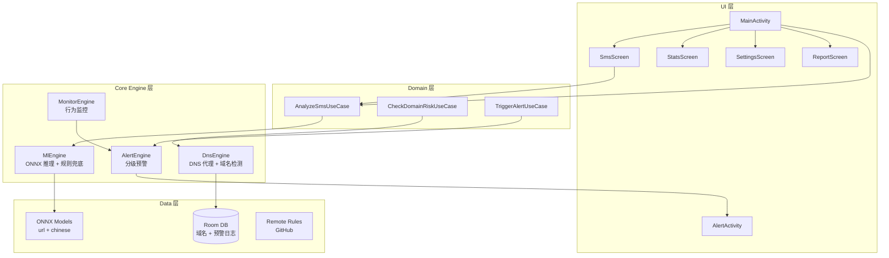
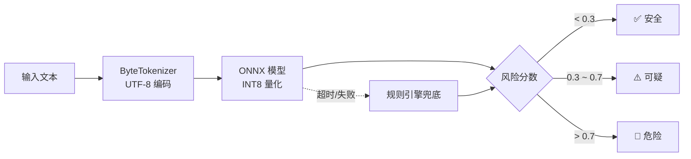
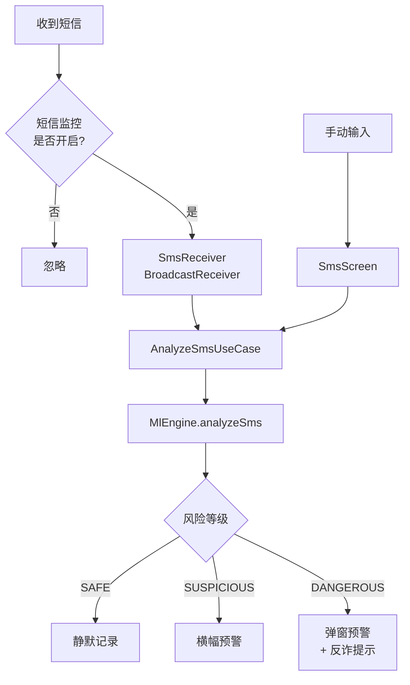

# TianshangGuard（天殇·破妄）

> **如果能少一人受骗，这个项目就有意义。**

[](https://github.com/tianshang-guard/guard/actions)
[](LICENSE)
[](https://developer.android.com/about/versions/oreo)
[](https://kotlinlang.org)

开源 Android 反诈工具，采用分层防御架构，**所有分析在设备本地完成，零数据上传**。

---

## 功能特性

| 功能 | 说明 |
|------|------|
| **DNS 域名拦截** | Bloom Filter 快速过滤 + 同形字符检测（Punycode/西里尔/全角） |
| **网页钓鱼检测** | Byte-level Transformer 端侧推理（ONNX Runtime） |
| **短信诈骗检测** | 手动粘贴分析 + BroadcastReceiver 实时拦截 |
| **行为监控** | 检测屏幕共享 + 银行应用组合，阻断社会工程学攻击 |
| **分级预警** | 静默记录 → 横幅提示 → 弹窗确认 → 全屏阻断 |
| **规则更新** | 远程拉取黑白名单，支持社区贡献 |

---

## 技术架构



### ML 推理流程



### 短信检测流程



---

## 快速开始

### 环境要求

- **JDK**: 17
- **Android SDK**: 35（compileSdk）
- **Gradle**: 8.x（项目自带 wrapper）
- **设备**: Android 8.0+（API 26）

### 构建

```bash
# 克隆仓库
git clone https://github.com/tianshang-guard/guard.git
cd guard

# 构建 Debug APK
./gradlew assembleDebug

# 安装到设备
adb install app/build/outputs/apk/debug/app-debug.apk
```

### 构建 Release

```bash
./gradlew assembleRelease
# APK 位于 app/build/outputs/apk/release/
```

---

## 模型训练

项目包含两个 BytePhishingTransformer 模型：

| 模型 | 数据集 | 参数量 | ONNX 体积 |
|------|--------|--------|-----------|
| URL 检测 | PhiUSIIL（23.5 万条） | 120,321 | 312 KB |
| 中文检测 | ChiFraud + 合成增强 | 644,865 | 1021 KB |

### 超参数

| 超参数 | URL 模型 | 中文模型 |
|--------|----------|----------|
| d_model | 64 | 128 |
| n_heads | 2 | 4 |
| n_layers | 2 | 4 |
| d_ff | 128 | 256 |
| max_seq_len | 512 | 512 |
| vocab_size | 256 | 256 |

### 训练命令

```bash
cd scripts

# 训练 URL 模型
python train_phishing_model.py --mode url

# 训练中文模型
python train_phishing_model.py --mode chinese
```

训练完成后，模型自动导出为 ONNX INT8 量化版本并复制到 `app/src/main/assets/model/`。

### 评估

```bash
# 验证 ONNX 推理
python test_onnx_models.py

# 拟合检查
python check_fitting.py
```

---

## 项目结构

```
tianshang-guard/
├── app/src/main/
│   ├── java/com/tianshang/guard/
│   │   ├── core/
│   │   │   ├── dns/          # DNS 引擎、同形字符检测、Bloom Filter
│   │   │   ├── ml/           # MlEngine、OnnxMlEngine、规则引擎
│   │   │   ├── monitor/      # 行为监控（屏幕共享检测）
│   │   │   ├── alert/        # 分级预警引擎
│   │   │   └── telemetry/    # 性能追踪
│   │   ├── data/
│   │   │   ├── local/        # Room 数据库、加密存储、偏好设置
│   │   │   ├── remote/       # GitHub 规则 API
│   │   │   └── repository/   # 数据仓库
│   │   ├── domain/           # UseCase 层
│   │   ├── service/          # VPN、前台服务、短信接收器、开机启动
│   │   ├── ui/               # Compose UI（主页、短信、统计、设置、预警）
│   │   └── di/               # Koin 依赖注入
│   └── assets/
│       ├── model/            # ONNX 模型文件
│       └── rules/            # 内置黑白名单
├── scripts/
│   ├── train_phishing_model.py  # 模型训练脚本
│   ├── merge_datasets.py        # 数据集合并
│   ├── validate_model.py        # 模型验证
│   └── raw_data/                # 训练数据
├── docs/
│   └── report.tex               # 技术报告（LaTeX）
└── .github/workflows/ci.yml     # CI 配置
```

---

## 隐私与安全

### 核心承诺

- **纯本地分析**：所有推理在设备端完成，零数据上传
- **开源可审计**：代码完全公开，接受社区审查
- **数据库加密**：Room + SQLCipher 加密存储（可选）
- **最小权限**：仅请求必要权限，用户可逐项控制

### 能力边界

**能防护**：
- 已知钓鱼域名访问
- 仿冒域名（视觉混淆、同形字符、音译混淆）
- 短信中的钓鱼话术和诈骗关键词
- 屏幕共享 + 银行应用组合的高风险操作
- 网页内容中的钓鱼话术

**不能防护**：
- 用户主动绕过保护（社会工程学核心难题）
- 电话诈骗（无网络流量特征）
- 零日钓鱼域名（未被收录）
- 加密通信内容（微信、银行 App 内 WebView）

---

## 贡献指南

```bash
# 1. Fork 仓库
# 2. 创建特性分支
git checkout -b feature/your-feature

# 3. 提交更改
git commit -m "Add your feature"

# 4. 推送分支
git push origin feature/your-feature

# 5. 创建 Pull Request
```

### 规则贡献

提交可疑域名到 `rules/community/` 目录，JSON 格式：

```json
{
  "domain": "example.com",
  "reason": "phishing",
  "source": "user_report"
}
```

---

## 致谢

- [PhiUSIIL](https://www.kaggle.com/datasets/shashwatwork/phiusiil-phishing-url-dataset) — URL 钓鱼数据集
- [ChiFraud](https://github.com/) — 中文欺诈短信数据集
- [ONNX Runtime](https://onnxruntime.ai/) — 端侧推理引擎
- [PhishTank](https://www.phishtank.com/) — 钓鱼域名情报

---

## License

[MIT](LICENSE) © Tianshang301
