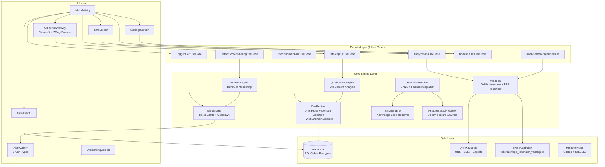
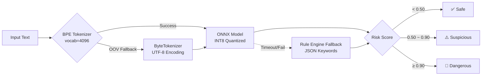
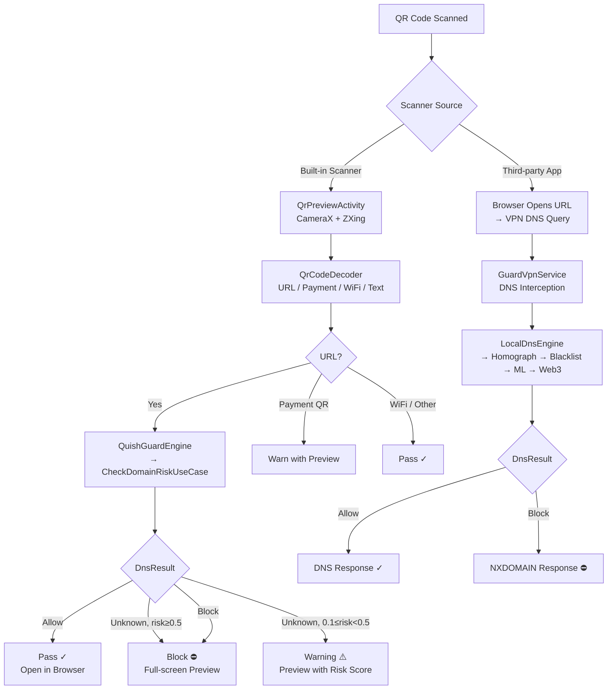
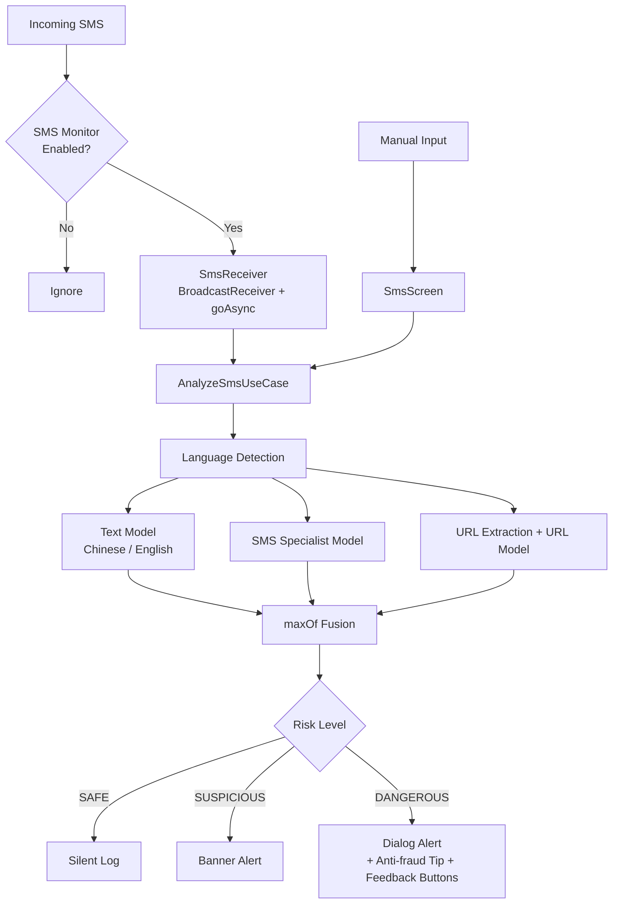

# TianshangGuard (天殇·破妄)

> **If even one person can be saved from fraud, this project is worth it.**

[](https://github.com/Tianshang301/TianshangGuard/actions)
[](LICENSE)
[](https://developer.android.com/about/versions/oreo)
[](https://kotlinlang.org)


Open-source Android anti-fraud tool with a layered defense architecture. **All analysis runs on-device — zero data upload.**

<p align="center">
  
</p>

[中文文档](readme/README.zh-CN.md)

---

## Features

| Feature | Description |
|---------|-------------|
| **DNS Domain Blocking** | Bloom Filter fast filtering + homograph detection (Punycode/Cyrillic/Greek/Fullwidth/Armenian) |
| **URL Phishing Detection** | Byte-level Transformer on-device inference (ONNX Runtime + NNAPI) |
| **SMS Scam Detection** | SMS model for Chinese + English, URL model for embedded links — on-device inference with dynamic model selection |
| **QR Code Phishing Guard** | Built-in ZXing QR scanner + CameraX preview + real-time URL risk analysis via DNS engine |
| **Web3 Domain Detection** | ENS `.eth`, Unstoppable `.crypto`, SID `.bnb` — rule-based detection, no ML dependency |
| **BPE Subword Tokenizer** | Vocabulary-based tokenizer with ByteTokenizer fallback — better Chinese character handling |
| **Behavior Monitoring** | Screen sharing + banking app combination detection via UsageStatsManager |
| **Tiered Alerts** | Silent log → Banner → Dialog confirmation → Full-screen block with cooldown and rate limiting |
| **Feedback Engine** | User feedback (phishing / false positive) integrated with BM25 retrieval for adaptive detection |
| **BM25 Knowledge Base** | Pre-computed retrieval index for anti-fraud educational content |
| **Feature-Based Prediction** | 24-dimensional feature extraction + online prediction with adaptive threshold calibration |
| **Rule Updates** | Remote blacklist/whitelist sync with SHA-256 integrity verification |
| **Database Encryption** | SQLCipher + Android Keystore for local data protection |
| **DNS Privacy** | DNS over HTTPS (DoH) with Cloudflare + certificate pinning + UDP fallback |
| **Battery Optimization** | Brand-specific battery/autostart settings (Huawei, Xiaomi, OPPO, vivo, Meizu, Samsung, Honor) |
| **Multi-language** | Chinese (zh), English (en), Unified (auto-detect) build flavors |

---

## What's New in v1.5.0

### QuishGuard — QR Code Phishing Interception
- **Built-in QR scanner**: CameraX-based scanning with ZXing Core decoding
- **Risk preview before opening**: Scanned QR URLs are analyzed by the DNS engine before the browser launches
- **Tiered decisions**: Pass (safe URLs) → Warn with preview (suspicious) → Block with preview (dangerous)
- **Quick Settings Tile**: One-tap QR scanner access from the notification shade
- **Layered defense**: Active protection (built-in scanner) + passive protection (VPN DNS blocking)

### Web3Guard — Blockchain Domain Detection
- **ENS detection**: Identifies `.eth` domains and resolves via Ethereum Name Service
- **Unstoppable Domains**: Detects `.crypto`, `.nft`, `.blockchain`, `.bitcoin`, `.wallet`, etc.
- **SID (Space ID)**: Detects `.bnb`, `.arb` domains on BNB Chain and Arbitrum
- **Pure rule-based**: Zero ML dependency, lightweight detection

### Security Infrastructure
- **Database encryption**: SQLCipher v4.5.4 with Android Keystore AES-GCM passphrase protection
- **Automatic migration**: Plaintext databases are transparently migrated to encrypted format on first launch
- **Security module tests**: 6 androidTests covering encryption, decryption, data persistence, migration, tamper detection

### Bug Fixes & Stability
- **59 security audit bugs identified**: 26 P0/P1 fixed (12 Critical + 14 High), 33 P2 deferred to v1.6.0
- **CIPHER_HOOK alignment**: All SQLCipher database connections now use consistent encryption parameters (cipher_page_size, kdf_iter, HMAC algorithm)
- **CIPHER_HOOK mismatch fixed**: Test helpers and production code now share the same `SQLiteDatabaseHook`, eliminating "file is not a database" errors
- **Migration engine rewritten**: Replaced `sqlcipher_export()` (incompatible with Android SQLite) with read-via-Android-SQLite + write-via-Room-DAOs pipeline
- **Tamper detection test**: New robust test with `withTimeout(5000)` to prevent SQLCipher native hangs on corrupted files
- **Test isolation**: All security tests now use UUID-unique database names to prevent inter-test contamination
- **26/26 androidTests pass** on real Huawei device (ADY-AL00)

---

## Architecture



### ML Inference Pipeline



### QR Code Scanning & Protection Flow



### SMS Detection Flow



---

## Quick Start

### Requirements

- **JDK**: 17
- **Android SDK**: 35 (compileSdk)
- **Gradle**: 8.x (wrapper included)
- **Device**: Android 8.0+ (API 26)

### Build

```bash
# Clone repository
git clone https://github.com/Tianshang301/TianshangGuard.git
cd TianshangGuard

# Build Chinese version
./gradlew assembleZhRelease

# Build English version
./gradlew assembleEnRelease

# Build Unified version (auto-detect language)
./gradlew assembleUnifiedRelease

# Install to device
adb install app/build/outputs/apk/zh/release/app-zh-release.apk
```

### Downloads

| Version | Language | Models Included | Status |
|---------|----------|-----------------|--------|
| [v1.5.0-chinese](https://github.com/Tianshang301/TianshangGuard/releases/tag/v1.5.0-chinese) | Chinese UI | URL + SMS | ✅ Released |
| [v1.5.0-english](https://github.com/Tianshang301/TianshangGuard/releases/tag/v1.5.0-english) | English UI | URL + English | ✅ Released |
| [v1.5.0-unified](https://github.com/Tianshang301/TianshangGuard/releases/tag/v1.5.0-unified) | Auto-detect (language switch in Settings) | URL + SMS + English | ✅ Released |

---

## Model Training

The project includes BytePhishingTransformer models:

| Model | File | Size | Parameters | Training Data | Performance |
|-------|------|------|------------|---------------|-------------|
| URL Detection | url_phishing.onnx | 105 KB | 120,321 | PhiUSIIL (235K URLs) | AUC=0.9942 |
| SMS Phishing | sms_phishing.onnx | 312 KB | 120,321 | FBS SMS + ChiFraud (11K) | Recall=97.88% |
| English Text | english_phishing.onnx | 312 KB | 120,321 | UCI + NCSU + IMC25 | TBD |
| Quantized Detection | phishing_detector_quant.onnx | 1022 KB | 120,321 | PhiUSIIL (INT8 quantized) | TBD |

### Hyperparameters

| Parameter | URL/SMS/EN Model |
|-----------|------------------|
| d_model | 64 |
| n_heads | 2 |
| n_layers | 2 |
| d_ff | 128 |
| max_seq_len | 512 |
| vocab_size | 256 |
| tokenizer | BPE (vocab=4096) + Byte fallback |

### Training Commands

```bash
cd scripts

# Train URL model
python train_phishing_model.py --mode url

# Train SMS model
python train_phishing_model.py --mode sms

# Train English model
python train_phishing_model.py --mode english

# Train BPE tokenizer
python train_bpe_tokenizer.py

# Knowledge distillation for SMS model
python distill_sms_model.py

# Back-translation augmentation
python backtranslate_augment.py --input raw_data/chifraud/ --output raw_data/augmented/

# ONNX export + calibration
python export_and_calibrate.py
```

Models are automatically exported as ONNX INT8 quantized and copied to `app/src/main/assets/model/`.

### Threshold Calibration

After training, calibrate optimal thresholds:

```bash
python _calibrate_thresholds.py
```

Current thresholds (deployed):
- **SAFE**: score < 0.50
- **SUSPICIOUS**: 0.50 – 0.90
- **DANGEROUS**: ≥ 0.90

> Note: `RiskLevel.toScore()` maps discrete levels to continuous midpoint values (SAFE→0.25, SUSPICIOUS→0.70, DANGEROUS→0.95) to avoid boundary escalation artifacts.

### Evaluation

```bash
# Validate ONNX inference
python test_onnx_models.py

# Model diagnosis
python diagnose_model.py

# Fitting check
python check_fitting.py
```

---

## Project Structure

```
TianshangGuard/
├── app/src/
│   ├── main/
│   │   ├── java/com/tianshang/guard/
│   │   │   ├── core/
│   │   │   │   ├── dns/           # DnsEngine, LocalDnsEngine, HomographDetector, BloomFilter, DnsPacketHandler, DohClient, BkTree, Web3DomainDetector
│   │   │   │   ├── ml/            # MlEngine, OnnxMlEngine, BpeTokenizer, ByteTokenizer, RuleBasedEngine, MlEngineWithFallback, InputSanitizer
│   │   │   │   ├── monitor/       # ScreenShareMonitor, RemoteConfigProvider
│   │   │   │   ├── alert/         # TieredAlertEngine, CooldownManager, AlertDataHolder
│   │   │   │   ├── feedback/      # FeedbackEngine (BM25 + feature integration)
│   │   │   │   ├── retrieval/     # Bm25Engine, KnowledgeBase
│   │   │   │   ├── rl/            # FeatureExtractor (24-dim), FeatureVector, FeatureStore, FeatureBasedPredictor
│   │   │   │   ├── calibration/   # ThresholdCalibrator
│   │   │   │   ├── update/        # RuleUpdateWorker (SHA-256 verified), RuleUpdateInteractor, SignatureVerifier
│   │   │   │   ├── optimizer/     # BatteryOptimizer (7 brands)
│   │   │   │   ├── quish/         # QuishGuardEngine, QrCodeDecoder (ZXing-based QR analysis)
│   │   │   │   ├── telemetry/     # PerformanceTracer
│   │   │   │   └── util/          # SecureLog, LocaleHelper
│   │   │   ├── data/
│   │   │   │   ├── local/
│   │   │   │   │   ├── database/  # GuardDatabase (Room), Dao, Entity
│   │   │   │   │   ├── security/  # EncryptedDatabaseProvider (SQLCipher)
│   │   │   │   │   └── GuardPreferences.kt (DataStore)
│   │   │   │   ├── remote/        # GithubRulesApi, PhishTankApi
│   │   │   │   └── repository/    # RuleRepository, AlertRepository
│   │   │   ├── domain/            # 7 UseCases: AnalyzeSms, AnalyzeWebPage, CheckDomainRisk, TriggerAlert, DetectScreenSharing, UpdateRules, InterceptQr
│   │   │   ├── service/           # GuardVpnService (DoH), ForegroundService, BootReceiver, SmsReceiver, QrScanTileService
│   │   │   ├── ui/                # Compose UI (main, sms, stats, settings, alert, qr, onboarding, theme)
│   │   │   └── di/                # AppModule (Koin)
│   │   ├── assets/
│   │   │   ├── model/             # 4 ONNX model files (+1 auto backup)
│   │   │   ├── tokenizer/         # bpe_tokenizer_vocab.json
│   │   │   ├── knowledge_base/    # BM25 pre-computed index (index.bin)
│   │   │   ├── rules/             # whitelist.json, blacklist.json, keywords_sms.json, keywords_web.json
│   │   │   └── test_data/         # sms/domain/feedback/alert/feature test cases
│   │   └── res/                   # Base resources
│   ├── zh/                        # Chinese flavor (GuardApplication + strings.xml)
│   ├── en/                        # English flavor
│   ├── unified/                   # Unified flavor (auto-detect language)
│   ├── test/                      # Unit tests (25 files, 168 tests)
│   └── androidTest/               # Instrumentation tests (4 files, 26 tests)
├── scripts/
│   ├── train_phishing_model.py    # Main training script
│   ├── train_bpe_tokenizer.py     # BPE tokenizer training
│   ├── distill_sms_model.py       # SMS model knowledge distillation
│   ├── backtranslate_augment.py   # Back-translation augmentation
│   ├── build_bm25_index.py        # BM25 index builder
│   ├── _calibrate_thresholds.py   # Threshold calibration
│   ├── export_and_calibrate.py    # ONNX export + calibration
│   └── raw_data/                  # Training datasets (PhiUSIIL, ChiFraud, FBS, English)
└── .github/workflows/
    ├── ci.yml                     # CI: unit tests
    └── build.yml                  # Build: APK artifacts (3 flavors)
```

---

## Privacy & Security

### Core Commitments

- **On-device analysis**: All inference runs locally via ONNX Runtime with NNAPI hardware acceleration
- **Database encryption**: SQLCipher + Android Keystore for local data protection
- **DNS privacy**: DNS over HTTPS (DoH) via Cloudflare, certificate pinning, UDP fallback
- **Rule integrity**: SHA-256 signature verification for rule updates (unsigned payloads rejected)
- **Feedback privacy**: User feedback (phishing / false positive) stored locally only, never uploaded
- **Feature extraction local**: All 24-dimensional feature analysis runs on-device
- **Open-source auditable**: Code is fully public, community review welcome
- **Minimal permissions**: Only essential permissions requested, user controls each

### Required Permissions

| Permission | Purpose |
|------------|---------|
| `BIND_VPN_SERVICE` ⚡ | VPN DNS interception — set as `<service android:permission>` attribute |
| `INTERNET` | DNS over HTTPS, GitHub rules update, PhishTank API |
| `SYSTEM_ALERT_WINDOW` | Overlay warnings for phishing alerts |
| `PACKAGE_USAGE_STATS` | Screen sharing + banking app detection |
| `RECEIVE_SMS` + `READ_SMS` | Incoming SMS phishing analysis |
| `CAMERA` + `FOREGROUND_SERVICE_CAMERA` | QR code scanning (v1.5.0) |
| `RECEIVE_BOOT_COMPLETED` | Auto-start protection on boot |
| `FOREGROUND_SERVICE` | Keep-alive service for continuous protection |
| `FOREGROUND_SERVICE_DATA_SYNC` | Android 14+ foreground service type declaration |
| `REQUEST_IGNORE_BATTERY_OPTIMIZATIONS` | Prevent battery optimization from killing service |
| `ACCESS_NETWORK_STATE` | Network connectivity checks for DoH fallback |
| `VIBRATE` | Vibrations for dangerous-level alerts |

### Capability Boundaries

**Can protect against**:
- Known phishing domain access
- Spoofed domains (visual confusion, homograph, transliteration)
- Phishing phrases and scam keywords in SMS (Chinese, English)
- Screen sharing + banking app high-risk operations
- Phishing content in web pages
- SMS phishing with embedded malicious URLs
- QR code phishing URLs (built-in scanner + VPN DNS dual layer)

**Cannot protect against**:
- Users voluntarily bypassing protection (core social engineering problem)
- Phone scams (no network traffic signature)
- Zero-day phishing domains (not yet indexed)
- Encrypted communication content (WeChat, in-app WebView)

---

## Tests

### Unit Tests (25 files, 168 tests)

| Module | Tests | Coverage |
|--------|-------|----------|
| `RuleBasedEngineTest` | 8 | Keyword matching logic |
| `HomographDetectorTest` | 11 | Homograph detection + pinyin confusion |
| `AdaptiveBloomFilterTest` | — | Bloom filter correctness |
| `CooldownManagerTest` | — | Alert cooldown logic |
| `BkTreeTest` | — | BK-tree operations |
| `DnsPacketHandlerTest` | — | DNS packet parsing |
| `DohClientTest` | — | DoH client |
| `BpeTokenizerTest` | — | BPE tokenizer |
| `ByteTokenizerTest` | — | Byte tokenizer |
| `OnnxMlEngineTest` | — | ONNX engine |
| `OnnxMlEngineSpikeTest` | — | ONNX integration |
| `FeatureExtractorTest` | — | Feature extraction |
| `Bm25EngineTest` | — | BM25 retrieval |
| `PerformanceTracerTest` | — | Performance metrics |
| `SignatureVerifierTest` | — | Signature verification |
| `FeedbackEngineTokenizerTest` | — | Feedback tokenization |
| `GuardPreferencesTest` | — | DataStore preferences |
| `RuleRepositoryTest` | — | Rule repository |
| `RuleUpdateInteractorTest` | — | Rule update interactor |
| `AnalyzeSmsUseCaseTest` | — | SMS analysis use case |
| `AnalyzeWebPageUseCaseTest` | — | Web page analysis |
| `CheckDomainRiskUseCaseTest` | — | Domain risk check |
| `UpdateRulesUseCaseTest` | — | Rules update |

### Android Instrumentation Tests (26 tests)

| Test Class | Tests | Status |
|-----------|-------|--------|
| `AlertDaoTest` | 5 | ✅ Pass |
| `DomainDaoTest` | 6 | ✅ Pass |
| `GuardPreferencesTest` | 9 | ✅ Pass |
| `SecurityModuleTest` | 6 | ✅ Pass (SQLCipher encryption, migration, tamper detection, Keystore) |

### Test Data (assets/test_data/)

| File | Cases | Coverage |
|------|-------|----------|
| `sms_test_cases.json` | 41 | Phishing + legitimate + English SMS |
| `domain_test_cases.json` | 27 | Whitelist, blacklist, homograph, punycode, suspicious, unknown |
| `feedback_test_cases.json` | 10 | Phishing + false positive scenarios |
| `alert_test_cases.json` | 10 | 6 alert types |
| `feature_test_cases.json` | 14 | 14 feature dimensions |

---

## Contributing

```bash
# 1. Fork repository
# 2. Create feature branch
git checkout -b feature/your-feature

# 3. Commit changes
git commit -m "Add your feature"

# 4. Push branch
git push origin feature/your-feature

# 5. Create Pull Request
```

### Rule Contributions

Submit suspicious domains to `rules/community/` directory in JSON format:

```json
{
  "domain": "example.com",
  "reason": "phishing",
  "source": "user_report"
}
```

---

## Acknowledgments

- [PhiUSIIL](https://www.kaggle.com/datasets/shashwatwork/phiusiil-phishing-url-dataset) — URL phishing dataset
- [ChiFraud](https://github.com/xuemingxxx/ChiFraud) — Chinese fraud SMS dataset
- [FBS SMS](https://www.kaggle.com/datasets/uciml/sms-spam-collection-dataset) — SMS spam collection
- [ONNX Runtime](https://onnxruntime.ai/) — On-device inference engine
- [PhishTank](https://www.phishtank.com/) — Phishing domain intelligence
- [SQLCipher](https://www.zetetic.net/sqlcipher/) — Encrypted database engine
- [CameraX](https://developer.android.com/training/camerax) — Camera API for QR scanning
- [ZXing](https://github.com/zxing/zxing) — QR code decoding library

---

## License

[MIT](LICENSE) © Tianshang301
