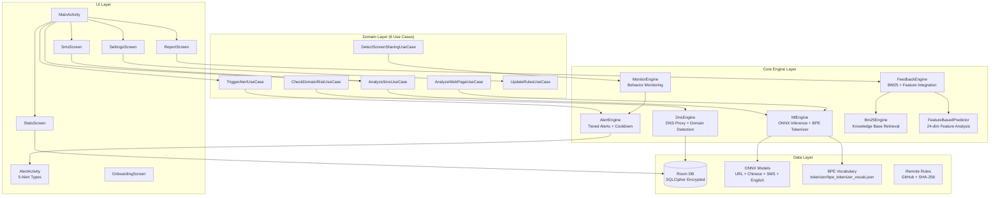
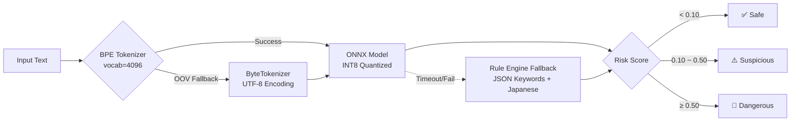
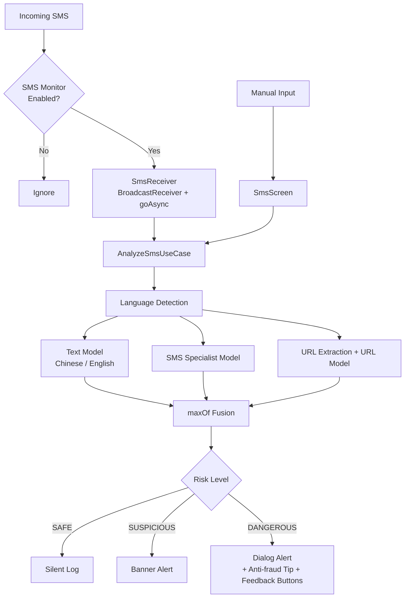

# TianshangGuard (天殇·破妄)

> **If even one person can be saved from fraud, this project is worth it.**

[](https://github.com/Tianshang301/TianshangGuard/actions)
[](LICENSE)
[](https://developer.android.com/about/versions/oreo)
[](https://kotlinlang.org)


Open-source Android anti-fraud tool with a layered defense architecture. **All analysis runs on-device — zero data upload.**

<p align="center">
  
</p>

[中文文档](readme/README.zh-CN.md)

---

## Features

| Feature | Description |
|---------|-------------|
| **DNS Domain Blocking** | Bloom Filter fast filtering + homograph detection (Punycode/Cyrillic/Greek/Fullwidth/Armenian) |
| **URL Phishing Detection** | Byte-level Transformer on-device inference (ONNX Runtime + NNAPI) |
| **SMS Scam Detection** | Multi-model fusion: language detection (Chinese/English) + SMS specialist model + URL extraction |
| **BPE Subword Tokenizer** | Vocabulary-based tokenizer with ByteTokenizer fallback — better Chinese character handling |
| **Behavior Monitoring** | Screen sharing + banking app combination detection via UsageStatsManager |
| **Tiered Alerts** | Silent log → Banner → Dialog confirmation → Full-screen block with cooldown and rate limiting |
| **Feedback Engine** | User feedback (phishing / false positive) integrated with BM25 retrieval for adaptive detection |
| **BM25 Knowledge Base** | Pre-computed retrieval index for anti-fraud educational content |
| **Feature-Based Prediction** | 24-dimensional feature extraction + online prediction with adaptive threshold calibration |
| **Rule Updates** | Remote blacklist/whitelist sync with SHA-256 integrity verification |
| **Database Encryption** | SQLCipher + Android Keystore for local data protection |
| **DNS Privacy** | DNS over HTTPS (DoH) with Cloudflare + certificate pinning + UDP fallback |
| **Battery Optimization** | Brand-specific battery/autostart settings (Huawei, Xiaomi, OPPO, vivo, Meizu, Samsung, Honor) |
| **Japanese Keyword Detection** | Built-in Japanese phishing keyword rules for SMS analysis |
| **Multi-language** | Chinese (zh), English (en), Unified (auto-detect) build flavors |

---

## What's New in v1.4.1

### Model & Tokenizer
- **BPE Tokenizer Integration**: Vocabulary-based subword tokenizer (vocab=4096) with automatic fallback to ByteTokenizer — improves Chinese text handling
- **4 ModelTypes**: URL, CHINESE, ENGLISH, and dedicated SMS specialist model
- **Knowledge Distillation**: SMS model trained using Chinese model as teacher (`distill_sms_model.py`)
- **Back-Translation Augmentation**: Chinese → English → Chinese pipeline for diverse training data

### Engine Enhancement
- **Feature Vector Expansion**: 8 → 24 dimensions for phishing detection
- **Feedback Loop**: User reports (phishing / false positive) feed into BM25 and feature-based prediction
- **Adaptive Threshold Calibration**: Momentum-based bias adjustment from real-world feedback
- **Strict Signature Verification**: Rule updates now reject unsigned payloads

### UI & Experience
- **Alert Details**: "Why was this flagged?" shows detection reasons, ML score, and feedback buttons
- **Statistics Dashboard**: Trend bar charts and risk distribution visualization
- **Report Screen**: User-submitted phishing report form
- **Onboarding Flow**: 3-page introduction for first-time users

### Infrastructure
- **Database Encryption**: SQLCipher + Android Keystore with automatic migration from unencrypted DB
- **DNS over HTTPS**: Cloudflare DoH with certificate pinning and transparent UDP fallback
- **Battery Optimization**: Brand-specific intent mapping for 7 major OEMs

---

## Architecture



### ML Inference Pipeline



### SMS Detection Flow



---

## Quick Start

### Requirements

- **JDK**: 17
- **Android SDK**: 35 (compileSdk)
- **Gradle**: 8.x (wrapper included)
- **Device**: Android 8.0+ (API 26)

### Build

```bash
# Clone repository
git clone https://github.com/Tianshang301/TianshangGuard.git
cd TianshangGuard

# Build Chinese version
./gradlew assembleZhRelease

# Build English version
./gradlew assembleEnRelease

# Build Unified version (auto-detect language)
./gradlew assembleUnifiedRelease

# Install to device
adb install app/build/outputs/apk/zh/release/app-zh-release.apk
```

### Downloads

| Version | Language | Models Included | Status |
|---------|----------|-----------------|--------|
| [v1.4.1-chinese](https://github.com/Tianshang301/TianshangGuard/releases/tag/v1.4.1-chinese) | Chinese UI | URL + Chinese + SMS | ✅ Released |
| [v1.4.1-english](https://github.com/Tianshang301/TianshangGuard/releases/tag/v1.4.1-english) | English UI | URL + English | ✅ Released |
| [v1.4.1-unified](https://github.com/Tianshang301/TianshangGuard/releases/tag/v1.4.1-unified) | Auto-detect (language switch in Settings) | URL + Chinese + SMS + English | ✅ Released |

---

## Model Training

The project includes BytePhishingTransformer models:

| Model | File | Size | Parameters | Training Data | Performance |
|-------|------|------|------------|---------------|-------------|
| URL Detection | url_phishing.onnx | 312 KB | 120,321 | PhiUSIIL (235K URLs) | AUC=0.9942 |
| Chinese Text | chinese_phishing.onnx | 1,021 KB | 644,865 | ChiFraud (82K cleaned) | AUC=0.9492 |
| SMS Phishing | sms_phishing.onnx | 312 KB | 120,321 | FBS SMS + ChiFraud (11K) | Recall=97.88% |
| English Text | english_phishing.onnx | 312 KB | 120,321 | UCI + NCSU + IMC25 | TBD |
| Quantized Detection | phishing_detector_quant.onnx | 1,021 KB | 644,865 | ChiFraud (INT8 quantized) | TBD |

### Hyperparameters

| Parameter | URL/SMS/EN Model | Chinese Model |
|-----------|------------------|---------------|
| d_model | 64 | 128 |
| n_heads | 2 | 4 |
| n_layers | 2 | 4 |
| d_ff | 128 | 256 |
| max_seq_len | 512 | 512 |
| vocab_size | 256 | 256 |
| tokenizer | BPE (vocab=4096) + Byte fallback | BPE (vocab=4096) + Byte fallback |

### Training Commands

```bash
cd scripts

# Train URL model
python train_phishing_model.py --mode url

# Train Chinese model
python train_phishing_model.py --mode chinese --fresh

# Train SMS model
python train_phishing_model.py --mode sms

# Train English model
python train_phishing_model.py --mode english

# Train BPE tokenizer
python train_bpe_tokenizer.py

# Knowledge distillation for SMS model
python distill_sms_model.py

# Back-translation augmentation
python backtranslate_augment.py --input raw_data/chifraud/ --output raw_data/augmented/

# ONNX export + calibration
python export_and_calibrate.py
```

Models are automatically exported as ONNX INT8 quantized and copied to `app/src/main/assets/model/`.

### Threshold Calibration

After training, calibrate optimal thresholds:

```bash
python _calibrate_thresholds.py
```

Current thresholds (deployed):
- **SAFE**: score < 0.10
- **SUSPICIOUS**: 0.10 – 0.50
- **DANGEROUS**: ≥ 0.50

> Note: `RiskLevel.toScore()` maps discrete levels to continuous midpoint values (SAFE→0.05, SUSPICIOUS→0.30, DANGEROUS→0.75) to avoid boundary escalation artifacts.

### Evaluation

```bash
# Validate ONNX inference
python test_onnx_models.py

# Model diagnosis
python diagnose_model.py

# Fitting check
python check_fitting.py
```

---

## Project Structure

```
TianshangGuard/
├── app/src/
│   ├── main/
│   │   ├── java/com/tianshang/guard/
│   │   │   ├── core/
│   │   │   │   ├── dns/           # DnsEngine, LocalDnsEngine, HomographDetector, BloomFilter, DnsPacketHandler, DohClient, BkTree
│   │   │   │   ├── ml/            # MlEngine, OnnxMlEngine, BpeTokenizer, ByteTokenizer, RuleBasedEngine, MlEngineWithFallback
│   │   │   │   ├── monitor/       # ScreenShareMonitor, RemoteConfigProvider
│   │   │   │   ├── alert/         # TieredAlertEngine, CooldownManager, AlertDataHolder
│   │   │   │   ├── feedback/      # FeedbackEngine (BM25 + feature integration)
│   │   │   │   ├── retrieval/     # Bm25Engine, KnowledgeBase
│   │   │   │   ├── rl/            # FeatureExtractor (24-dim), FeatureVector, FeatureStore, FeatureBasedPredictor
│   │   │   │   ├── calibration/   # ThresholdCalibrator
│   │   │   │   ├── update/        # RuleUpdateWorker (SHA-256 verified)
│   │   │   │   ├── optimizer/     # BatteryOptimizer (7 brands)
│   │   │   │   ├── telemetry/     # PerformanceTracer
│   │   │   │   └── util/          # SecureLog, LocaleHelper
│   │   │   ├── data/
│   │   │   │   ├── local/         # GuardDatabase (Room + SQLCipher), GuardPreferences (DataStore), security/
│   │   │   │   ├── remote/        # GithubRulesApi, PhishTankApi
│   │   │   │   └── repository/    # RuleRepository, AlertRepository
│   │   │   ├── domain/            # 6 UseCases: AnalyzeSms, AnalyzeWebPage, CheckDomainRisk, TriggerAlert, DetectScreenSharing, UpdateRules
│   │   │   ├── service/           # GuardVpnService (DoH), ForegroundService, BootReceiver, SmsReceiver
│   │   │   ├── ui/                # Compose UI (main, sms, stats, settings, alert, report, onboarding, theme)
│   │   │   └── di/                # AppModule (Koin)
│   │   ├── assets/
│   │   │   ├── model/             # 5 ONNX model files
│   │   │   ├── tokenizer/         # bpe_tokenizer_vocab.json
│   │   │   ├── knowledge_base/    # BM25 pre-computed index (index.bin)
│   │   │   ├── rules/             # whitelist.json, blacklist.json, keywords_sms.json, keywords_sms_ja.json, keywords_web.json
│   │   │   └── test_data/         # sms/domain/feedback/alert/feature test cases
│   │   └── res/                   # Base resources
│   ├── zh/                        # Chinese flavor (GuardApplication + strings.xml)
│   ├── en/                        # English flavor
│   ├── unified/                   # Unified flavor (auto-detect language)
│   └── test/                      # Unit tests (4 test files)
├── scripts/
│   ├── train_phishing_model.py    # Main training script
│   ├── train_bpe_tokenizer.py     # BPE tokenizer training
│   ├── distill_sms_model.py       # SMS model knowledge distillation
│   ├── backtranslate_augment.py   # Back-translation augmentation
│   ├── build_bm25_index.py        # BM25 index builder
│   ├── _calibrate_thresholds.py   # Threshold calibration
│   ├── export_and_calibrate.py    # ONNX export + calibration
│   └── raw_data/                  # Training datasets (PhiUSIIL, ChiFraud, FBS, English, Japanese)
└── .github/workflows/
    ├── ci.yml                     # CI: unit tests
    └── build.yml                  # Build: APK artifacts (3 flavors)
```

---

## Privacy & Security

### Core Commitments

- **On-device analysis**: All inference runs locally via ONNX Runtime with NNAPI hardware acceleration
- **Database encryption**: SQLCipher + Android Keystore for local data protection
- **DNS privacy**: DNS over HTTPS (DoH) via Cloudflare, certificate pinning, UDP fallback
- **Rule integrity**: SHA-256 signature verification for rule updates (unsigned payloads rejected)
- **Feedback privacy**: User feedback (phishing / false positive) stored locally only, never uploaded
- **Feature extraction local**: All 24-dimensional feature analysis runs on-device
- **Open-source auditable**: Code is fully public, community review welcome
- **Minimal permissions**: Only essential permissions requested, user controls each

### Capability Boundaries

**Can protect against**:
- Known phishing domain access
- Spoofed domains (visual confusion, homograph, transliteration)
- Phishing phrases and scam keywords in SMS (Chinese, English, Japanese)
- Screen sharing + banking app high-risk operations
- Phishing content in web pages
- SMS phishing with embedded malicious URLs

**Cannot protect against**:
- Users voluntarily bypassing protection (core social engineering problem)
- Phone scams (no network traffic signature)
- Zero-day phishing domains (not yet indexed)
- Encrypted communication content (WeChat, in-app WebView)

---

## Unit Tests

| Test File | Tests | Coverage |
|-----------|-------|----------|
| `RuleBasedEngineTest.kt` | 8 | Keyword matching logic |
| `HomographDetectorTest.kt` | 7 | Homograph detection + pinyin confusion |
| `AdaptiveBloomFilterTest.kt` | — | Bloom filter correctness |
| `CooldownManagerTest.kt` | — | Alert cooldown logic |

### Test Data (assets/test_data/)

| File | Cases | Coverage |
|------|-------|----------|
| `sms_test_cases.json` | ~43 | Phishing + legitimate + English SMS |
| `domain_test_cases.json` | 22 | Whitelist, blacklist, homograph, punycode, suspicious, unknown |
| `feedback_test_cases.json` | 10 | Phishing + false positive scenarios |
| `alert_test_cases.json` | 10 | 6 alert types |
| `feature_test_cases.json` | 14 | 14 feature dimensions |

---

## Contributing

```bash
# 1. Fork repository
# 2. Create feature branch
git checkout -b feature/your-feature

# 3. Commit changes
git commit -m "Add your feature"

# 4. Push branch
git push origin feature/your-feature

# 5. Create Pull Request
```

### Rule Contributions

Submit suspicious domains to `rules/community/` directory in JSON format:

```json
{
  "domain": "example.com",
  "reason": "phishing",
  "source": "user_report"
}
```

---

## Acknowledgments

- [PhiUSIIL](https://www.kaggle.com/datasets/shashwatwork/phiusiil-phishing-url-dataset) — URL phishing dataset
- [ChiFraud](https://github.com/xuemingxxx/ChiFraud) — Chinese fraud SMS dataset
- [FBS SMS](https://www.kaggle.com/datasets/uciml/sms-spam-collection-dataset) — SMS spam collection
- [ONNX Runtime](https://onnxruntime.ai/) — On-device inference engine
- [PhishTank](https://www.phishtank.com/) — Phishing domain intelligence
- [SQLCipher](https://www.zetetic.net/sqlcipher/) — Encrypted database engine

---

## License

[MIT](LICENSE) © Tianshang301
