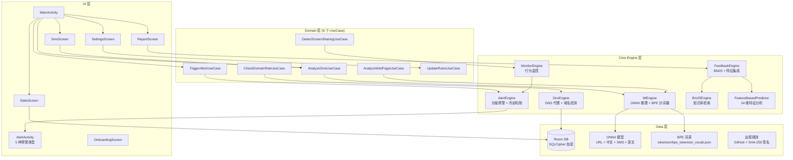
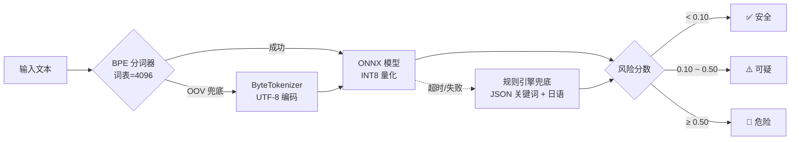
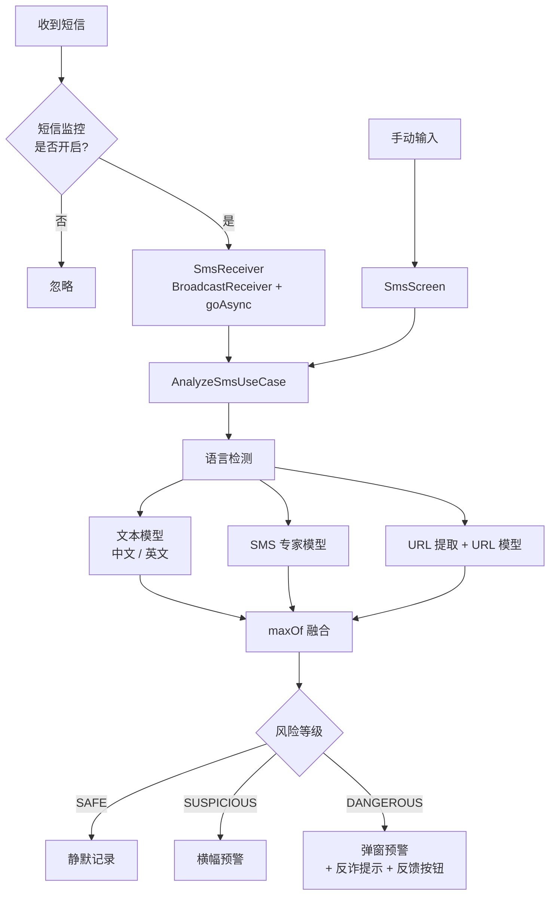

# TianshangGuard（天殇·破妄）

> **如果能少一人受骗，这个项目就有意义。**

[](https://github.com/Tianshang301/TianshangGuard/actions)
[](LICENSE)
[](https://developer.android.com/about/versions/oreo)
[](https://kotlinlang.org)


开源 Android 反诈工具，采用分层防御架构，**所有分析在设备本地完成，零数据上传**。

<p align="center">
  
</p>

[English](../README.md)

---

## 功能特性

| 功能 | 说明 |
|------|------|
| **DNS 域名拦截** | Bloom Filter 快速过滤 + 同形字符检测（西里尔/希腊/全角/亚美尼亚） |
| **网页钓鱼检测** | Byte-level Transformer 端侧推理（ONNX Runtime + NNAPI） |
| **短信诈骗检测** | 多模型融合：语言检测（中/英）+ SMS 专家模型 + URL 提取 + 日语关键词 |
| **BPE 子词分词器** | 基于词表的子词分词器，ByteTokenizer 兜底 — 更好的中文处理能力 |
| **行为监控** | 检测屏幕共享 + 银行应用组合，阻断社会工程学攻击 |
| **分级预警** | 静默记录 → 横幅提示 → 弹窗确认 → 全屏阻断，含冷却和频率限制 |
| **反馈引擎** | 用户标记（钓鱼/误报）融入 BM25 检索和特征预测，实现自适应检测 |
| **BM25 知识库** | 预计算反诈教育内容检索索引 |
| **特征预测** | 24 维特征提取 + 在线预测 + 自适应阈值校准 |
| **规则更新** | 远程拉取黑白名单，SHA-256 签名验证 |
| **数据库加密** | SQLCipher + Android Keystore 本地数据加密 |
| **DNS 隐私** | DNS over HTTPS（Cloudflare DoH）+ 证书锁定 + UDP 降级 |
| **电池优化** | 7 大品牌（华为/小米/OPPO/vivo/魅族/三星/荣耀）自动适配 |
| **日语关键词检测** | 内置日语钓鱼关键词规则 |
| **多语言支持** | 中文（zh）、英文（en）、统一版（自动检测）三种构建变体 |

---

## v1.4.1 更新内容

### 模型与分词器
- **BPE 分词器集成**：基于词表的子词分词器（词表=4096），ByteTokenizer 自动兜底 — 改善中文文本处理
- **4 种模型类型**：URL、中文、英文、独立 SMS 专家模型
- **知识蒸馏**：使用中文模型作为教师蒸馏 SMS 模型（`distill_sms_model.py`）
- **回译增强**：中文 → 英文 → 中文数据增强流水线

### 引擎增强
- **特征向量扩展**：8 维 → 24 维特征空间
- **反馈闭环**：用户标记（钓鱼/误报）融入 BM25 和特征预测
- **自适应阈值校准**：基于真实反馈的动量偏置调整
- **严格签名验证**：规则更新拒绝未签名负载

### UI 与体验
- **预警详情**：显示检测原因、ML 分数和反馈按钮
- **统计面板**：趋势柱状图和风险分布可视化
- **举报页面**：用户提交钓鱼报告
- **首次引导**：3 页介绍引导新用户

### 基础设施
- **数据库加密**：SQLCipher + Android Keystore，自动从明文数据库迁移
- **DNS over HTTPS**：Cloudflare DoH + 证书锁定 + 透明 UDP 降级
- **电池优化**：7 大主流品牌的特定意图适配

---

## 技术架构



### ML 推理流程



### 短信检测流程



---

## 快速开始

### 环境要求

- **JDK**: 17
- **Android SDK**: 35（compileSdk）
- **Gradle**: 8.x（项目自带 wrapper）
- **设备**: Android 8.0+（API 26）

### 构建

```bash
# 克隆仓库
git clone https://github.com/Tianshang301/TianshangGuard.git
cd TianshangGuard

# 构建中文版（推荐）
./gradlew assembleZhRelease

# 构建英文版
./gradlew assembleEnRelease

# 构建统一版（自动检测语言）
./gradlew assembleUnifiedRelease

# 安装到设备
adb install app/build/outputs/apk/zh/release/app-zh-release.apk
```

### 下载

| 版本 | 语言 | 包含模型 | 状态 |
|------|------|----------|------|
| [v1.4.2-中文版](https://github.com/Tianshang301/TianshangGuard/releases/tag/v1.4.2-chinese) | 中文 UI | URL + 中文 + SMS | ✅ 已发布 |
| [v1.4.2-英文版](https://github.com/Tianshang301/TianshangGuard/releases/tag/v1.4.2-english) | 英文 UI | URL + 英文 | ✅ 已发布 |
| [v1.4.2-统一版](https://github.com/Tianshang301/TianshangGuard/releases/tag/v1.4.2-unified) | 自动检测（设置中可切换语言） | URL + 中文 + SMS + 英文 | ✅ 已发布 |

---

## 模型训练

项目包含五个 BytePhishingTransformer 模型：

| 模型 | 文件 | 大小 | 参数量 | 训练数据 | 性能 |
|------|------|------|--------|----------|------|
| URL 检测 | url_phishing.onnx | 312 KB | 120,321 | PhiUSIIL（23.5 万条） | AUC=0.9942 |
| 中文文本 | chinese_phishing.onnx | 1,021 KB | 644,865 | ChiFraud（8.2 万条清洗） | AUC=0.9492 |
| SMS 诈骗 | sms_phishing.onnx | 312 KB | 120,321 | FBS SMS + ChiFraud（1.1 万条） | Recall=97.88% |
| 英文文本 | english_phishing.onnx | 312 KB | 120,321 | UCI + NCSU + IMC25 | 待测试 |
| 量化检测 | phishing_detector_quant.onnx | 1,021 KB | 644,865 | ChiFraud（INT8 量化） | 待测试 |

### 超参数

| 超参数 | URL/SMS/EN 模型 | 中文模型 |
|--------|-----------------|----------|
| d_model | 64 | 128 |
| n_heads | 2 | 4 |
| n_layers | 2 | 4 |
| d_ff | 128 | 256 |
| max_seq_len | 512 | 512 |
| vocab_size | 256 | 256 |
| 分词器 | BPE（词表=4096）+ Byte 兜底 | BPE（词表=4096）+ Byte 兜底 |

### 训练命令

```bash
cd scripts

# 训练 URL 模型
python train_phishing_model.py --mode url

# 训练中文模型
python train_phishing_model.py --mode chinese --fresh

# 训练 SMS 模型
python train_phishing_model.py --mode sms

# 训练英文模型
python train_phishing_model.py --mode english

# 训练 BPE 分词器
python train_bpe_tokenizer.py

# SMS 模型知识蒸馏
python distill_sms_model.py

# 回译数据增强
python backtranslate_augment.py --input raw_data/chifraud/ --output raw_data/augmented/

# ONNX 导出 + 校准
python export_and_calibrate.py
```

训练完成后，模型自动导出为 ONNX INT8 量化版本并复制到 `app/src/main/assets/model/`。

### 阈值校准

训练后校准最优阈值：

```bash
python _calibrate_thresholds.py
```

当前阈值（已部署）：
- **SAFE**: 分数 < 0.10
- **SUSPICIOUS**: 0.10 – 0.50
- **DANGEROUS**: ≥ 0.50

> `RiskLevel.toScore()` 将离散等级映射为连续中点值（SAFE→0.05，SUSPICIOUS→0.30，DANGEROUS→0.75），避免边界值升级问题。

### 评估

```bash
# 验证 ONNX 推理
python test_onnx_models.py

# 模型诊断
python diagnose_model.py

# 拟合检查
python check_fitting.py
```

---

## 项目结构

```
TianshangGuard/
├── app/src/
│   ├── main/
│   │   ├── java/com/tianshang/guard/
│   │   │   ├── core/
│   │   │   │   ├── dns/           # DNS 引擎、同形字符检测、Bloom Filter、BK-tree、DoH
│   │   │   │   ├── ml/            # 推理引擎、BPE 分词器、Byte 分词器、规则引擎
│   │   │   │   ├── monitor/       # 行为监控（屏幕共享检测）
│   │   │   │   ├── alert/         # 分级预警、冷却管理
│   │   │   │   ├── feedback/      # 反馈引擎（BM25 + 特征集成）
│   │   │   │   ├── retrieval/     # BM25 检索、知识库
│   │   │   │   ├── rl/            # 特征提取（24维）、特征预测
│   │   │   │   ├── calibration/   # 自适应阈值校准
│   │   │   │   ├── update/        # 规则更新（SHA-256 签名验证）
│   │   │   │   ├── optimizer/     # 电池优化（7 品牌）
│   │   │   │   ├── telemetry/     # 性能追踪
│   │   │   │   └── util/          # 安全日志、语言助手
│   │   │   ├── data/
│   │   │   │   ├── local/         # Room 数据库（SQLCipher 加密）、DataStore 偏好
│   │   │   │   ├── remote/        # GitHub 规则 API、PhishTank API
│   │   │   │   └── repository/    # 数据仓库
│   │   │   ├── domain/            # 6 个 UseCase
│   │   │   ├── service/           # VPN 服务（DoH）、前台服务、开机启动、短信接收
│   │   │   ├── ui/                # Compose UI（主页、短信、统计、设置、预警、举报、引导、主题）
│   │   │   └── di/                # Koin 依赖注入
│   │   ├── assets/
│   │   │   ├── model/             # 5 个 ONNX 模型文件
│   │   │   ├── tokenizer/         # BPE 词表
│   │   │   ├── knowledge_base/    # BM25 预计算索引
│   │   │   ├── rules/             # 内置黑白名单和关键词规则（含日语）
│   │   │   └── test_data/         # 测试用例数据
│   │   └── res/
│   ├── zh/                        # 中文变体
│   ├── en/                        # 英文变体
│   ├── unified/                   # 统一版变体（自动检测语言）
│   └── test/                      # 单元测试（4 个测试文件）
├── scripts/
│   ├── train_phishing_model.py    # 主训练脚本
│   ├── train_bpe_tokenizer.py     # BPE 分词器训练
│   ├── distill_sms_model.py       # SMS 模型知识蒸馏
│   ├── backtranslate_augment.py   # 回译数据增强
│   ├── build_bm25_index.py        # BM25 索引构建
│   ├── _calibrate_thresholds.py   # 阈值校准
│   ├── export_and_calibrate.py    # ONNX 导出 + 校准
│   └── raw_data/                  # 训练数据集
└── .github/workflows/
    ├── ci.yml                     # CI: 单元测试
    └── build.yml                  # 构建: APK 构建（3 种变体）
```

---

## 隐私与安全

### 核心承诺

- **纯本地分析**：所有推理通过 ONNX Runtime + NNAPI 硬件加速在设备端完成
- **数据库加密**：SQLCipher + Android Keystore 保护所有本地数据
- **DNS 隐私**：DNS over HTTPS（Cloudflare DoH）+ 证书锁定 + UDP 降级
- **规则完整性**：SHA-256 签名验证，未签名负载被拒绝
- **反馈隐私**：用户标记仅本地存储，不上传
- **特征分析本地**：24 维特征分析全部在设备端完成
- **开源可审计**：代码完全公开，接受社区审查
- **最小权限**：仅请求必要权限，用户可逐项控制

### 能力边界

**能防护**：
- 已知钓鱼域名访问
- 仿冒域名（视觉混淆、同形字符、音译混淆）
- 短信中的钓鱼话术和诈骗关键词（中文、英文、日语）
- 屏幕共享 + 银行应用组合的高风险操作
- 网页内容中的钓鱼话术
- 含恶意 URL 的短信

**不能防护**：
- 用户主动绕过保护（社会工程学核心难题）
- 电话诈骗（无网络流量特征）
- 零日钓鱼域名（未被收录）
- 加密通信内容（微信、银行 App 内 WebView）

---

## 单元测试

| 测试文件 | 用例数 | 覆盖范围 |
|----------|--------|----------|
| `RuleBasedEngineTest.kt` | 8 | 关键词匹配逻辑 |
| `HomographDetectorTest.kt` | 7 | 同形字符检测 + 拼音混淆 |
| `AdaptiveBloomFilterTest.kt` | — | Bloom 过滤器正确性 |
| `CooldownManagerTest.kt` | — | 预警冷却逻辑 |

### 测试数据（assets/test_data/）

| 文件 | 用例数 | 覆盖范围 |
|------|--------|----------|
| `sms_test_cases.json` | ~43 | 钓鱼 + 正常 + 英文短信 |
| `domain_test_cases.json` | 22 | 白名单、黑名单、同形字符、Punycode、可疑、未知 |
| `feedback_test_cases.json` | 10 | 误报 + 钓鱼场景 |
| `alert_test_cases.json` | 10 | 6 种预警类型 |
| `feature_test_cases.json` | 14 | 14 个特征维度 |

---

## 贡献指南

```bash
# 1. Fork 仓库
# 2. 创建特性分支
git checkout -b feature/your-feature

# 3. 提交更改
git commit -m "Add your feature"

# 4. 推送分支
git push origin feature/your-feature

# 5. 创建 Pull Request
```

### 规则贡献

提交可疑域名到 `rules/community/` 目录，JSON 格式：

```json
{
  "domain": "example.com",
  "reason": "phishing",
  "source": "user_report"
}
```

---

## 致谢

- [PhiUSIIL](https://www.kaggle.com/datasets/shashwatwork/phiusiil-phishing-url-dataset) — URL 钓鱼数据集
- [ChiFraud](https://github.com/xuemingxxx/ChiFraud) — 中文欺诈短信数据集
- [FBS SMS](https://www.kaggle.com/datasets/uciml/sms-spam-collection-dataset) — SMS 垃圾数据集
- [ONNX Runtime](https://onnxruntime.ai/) — 端侧推理引擎
- [PhishTank](https://www.phishtank.com/) — 钓鱼域名情报
- [SQLCipher](https://www.zetetic.net/sqlcipher/) — 数据库加密引擎

---

## License

[MIT](../LICENSE) © Tianshang301
