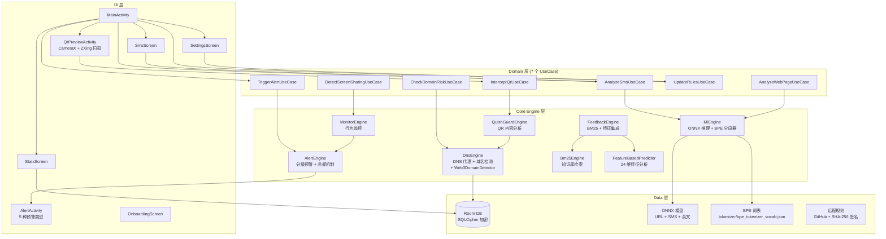
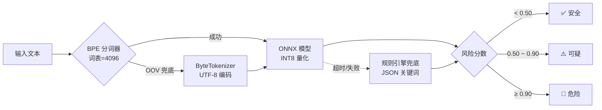
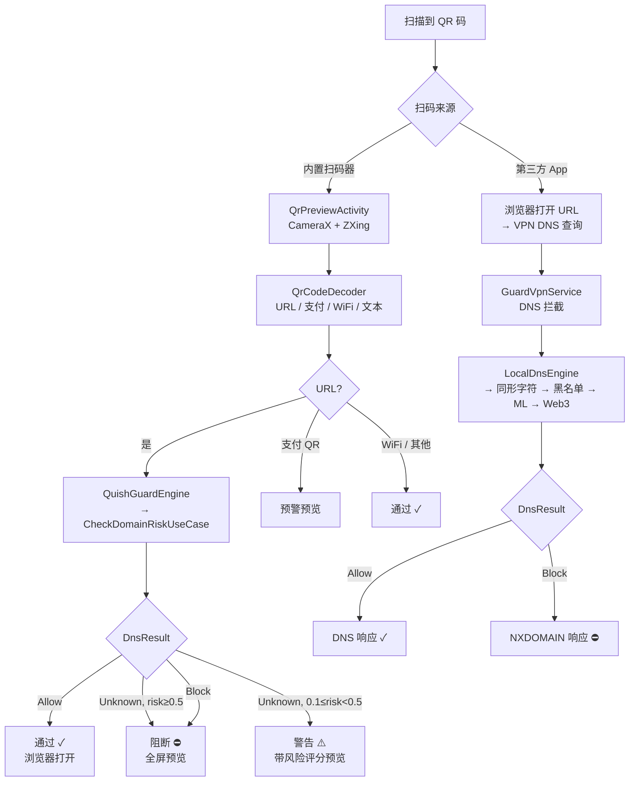
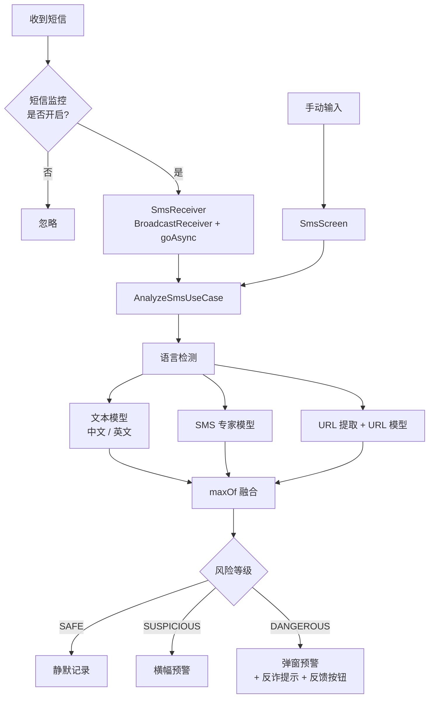

# TianshangGuard（天殇·破妄）

> **如果能少一人受骗，这个项目就有意义。**

[](https://github.com/Tianshang301/TianshangGuard/actions)
[](LICENSE)
[](https://developer.android.com/about/versions/oreo)
[](https://kotlinlang.org)


开源 Android 反诈工具，采用分层防御架构，**所有分析在设备本地完成，零数据上传**。

<p align="center">
  
</p>

[English](../README.md)

---

## 功能特性

| 功能 | 说明 |
|------|------|
| **DNS 域名拦截** | Bloom Filter 快速过滤 + 同形字符检测（西里尔/希腊/全角/亚美尼亚） |
| **网页钓鱼检测** | Byte-level Transformer 端侧推理（ONNX Runtime + NNAPI） |
| **短信诈骗检测** | SMS 模型处理中英文短信，URL 模型分析嵌入链接 — 端侧推理，动态模型选择 |
| **QR 码钓鱼拦截** | 内置 ZXing 扫码器 + CameraX 预览 + DNS 引擎实时 URL 风险分析 |
| **Web3 域名检测** | ENS `.eth`、Unstoppable `.crypto`、SID `.bnb` — 纯规则检测，无需 ML |
| **BPE 子词分词器** | 基于词表的子词分词器，ByteTokenizer 兜底 — 更好的中文处理能力 |
| **行为监控** | 检测屏幕共享 + 银行应用组合，阻断社会工程学攻击 |
| **分级预警** | 静默记录 → 横幅提示 → 弹窗确认 → 全屏阻断，含冷却和频率限制 |
| **反馈引擎** | 用户标记（钓鱼/误报）融入 BM25 检索和特征预测，实现自适应检测 |
| **BM25 知识库** | 预计算反诈教育内容检索索引 |
| **特征预测** | 24 维特征提取 + 在线预测 + 自适应阈值校准 |
| **规则更新** | 远程拉取黑白名单，SHA-256 签名验证 |
| **数据库加密** | SQLCipher + Android Keystore 本地数据加密 |
| **DNS 隐私** | DNS over HTTPS（Cloudflare DoH）+ 证书锁定 + UDP 降级 |
| **电池优化** | 7 大品牌（华为/小米/OPPO/vivo/魅族/三星/荣耀）自动适配 |
| **多语言支持** | 中文（zh）、英文（en）、统一版（自动检测）三种构建变体 |

---

## v1.5.0 更新内容

### QuishGuard — QR 码钓鱼拦截
- **内置 QR 扫码器**：基于 CameraX + ZXing Core 的扫码页面
- **扫码前风险预览**：扫码后 URL 先经 DNS 引擎分析再决定是否打开浏览器
- **三级决策**：通过（安全 URL）→ 预警预览（可疑）→ 阻断预览（危险）
- **快捷设置磁贴**：从通知栏一键打开扫码器
- **分层防护**：主动防护（内置扫码器）+ 被动防护（VPN DNS 阻断）

### Web3Guard — 区块链域名检测
- **ENS 检测**：识别 `.eth` 域名，通过以太坊名称服务解析
- **Unstoppable Domains**：检测 `.crypto`、`.nft`、`.blockchain` 等去中心化域名
- **SID（Space ID）**：检测 `.bnb`、`.arb` 等 BNB Chain 和 Arbitrum 域名
- **纯规则实现**：零 ML 依赖，轻量检测

### 安全基础设施
- **数据库加密**：SQLCipher v4.5.4 + Android Keystore AES-GCM 密码保护
- **自动迁移**：首次启动时明文字库透明迁移至加密格式
- **安全模块测试**：6 个 androidTest 覆盖加密、解密、持久化、迁移、篡改检测

### Bug 修复与稳定性
- **59 个安全审计问题识别**：修复 26 个 P0/P1（12 Critical + 14 High），33 个 P2 延至 v1.6.0
- **CIPHER_HOOK 统一**：所有 SQLCipher 数据库连接使用一致的加密参数
- **CIPHER_HOOK 不匹配修复**：测试辅助函数和生产代码共享同一 `SQLiteDatabaseHook`，消除 "file is not a database" 错误
- **迁移引擎重写**：用 Android SQLite 读取 + Room DAOs 写入的管道替代不可用的 `sqlcipher_export()`
- **篡改检测测试**：新增 `withTimeout(5000)` 健壮测试，防止 SQLCipher 在损坏文件上阻塞
- **测试隔离**：所有安全测试使用 UUID 唯一数据库名，避免跨测试污染
- **26/26 androidTest 全部通过**（华为 ADY-AL00 真机验证）

---

## 技术架构



### ML 推理流程



### QR 码扫描与防护流程



### 短信检测流程



---

## 快速开始

### 环境要求

- **JDK**: 17
- **Android SDK**: 35（compileSdk）
- **Gradle**: 8.x（项目自带 wrapper）
- **设备**: Android 8.0+（API 26）

### 构建

```bash
# 克隆仓库
git clone https://github.com/Tianshang301/TianshangGuard.git
cd TianshangGuard

# 构建中文版（推荐）
./gradlew assembleZhRelease

# 构建英文版
./gradlew assembleEnRelease

# 构建统一版（自动检测语言）
./gradlew assembleUnifiedRelease

# 安装到设备
adb install app/build/outputs/apk/zh/release/app-zh-release.apk
```

### 下载

| 版本 | 语言 | 包含模型 | 状态 |
|------|------|----------|------|
| [v1.5.0-中文版](https://github.com/Tianshang301/TianshangGuard/releases/tag/v1.5.0-chinese) | 中文 UI | URL + SMS | ✅ 已发布 |
| [v1.5.0-英文版](https://github.com/Tianshang301/TianshangGuard/releases/tag/v1.5.0-english) | 英文 UI | URL + 英文 | ✅ 已发布 |
| [v1.5.0-统一版](https://github.com/Tianshang301/TianshangGuard/releases/tag/v1.5.0-unified) | 自动检测（设置中可切换语言） | URL + SMS + 英文 | ✅ 已发布 |

---

## 模型训练

项目包含 BytePhishingTransformer 模型：

| 模型 | 文件 | 大小 | 参数量 | 训练数据 | 性能 |
|------|------|------|--------|----------|------|
| URL 检测 | url_phishing.onnx | 105 KB | 120,321 | PhiUSIIL（23.5 万条） | AUC=0.9942 |
| SMS 诈骗 | sms_phishing.onnx | 312 KB | 120,321 | FBS SMS + ChiFraud（1.1 万条） | Recall=97.88% |
| 英文文本 | english_phishing.onnx | 312 KB | 120,321 | UCI + NCSU + IMC25 | 待测试 |
| 量化检测 | phishing_detector_quant.onnx | 1022 KB | 120,321 | PhiUSIIL（INT8 量化） | 待测试 |

### 超参数

| 超参数 | URL/SMS/EN 模型 |
|--------|----------------|
| d_model | 64 |
| n_heads | 2 |
| n_layers | 2 |
| d_ff | 128 |
| max_seq_len | 512 |
| vocab_size | 256 |
| 分词器 | BPE（词表=4096）+ Byte 兜底 |

### 训练命令

```bash
cd scripts

# 训练 URL 模型
python train_phishing_model.py --mode url

# 训练 SMS 模型
python train_phishing_model.py --mode sms

# 训练英文模型
python train_phishing_model.py --mode english

# 训练 BPE 分词器
python train_bpe_tokenizer.py

# SMS 模型知识蒸馏
python distill_sms_model.py

# 回译数据增强
python backtranslate_augment.py --input raw_data/chifraud/ --output raw_data/augmented/

# ONNX 导出 + 校准
python export_and_calibrate.py
```

训练完成后，模型自动导出为 ONNX INT8 量化版本并复制到 `app/src/main/assets/model/`。

### 阈值校准

训练后校准最优阈值：

```bash
python _calibrate_thresholds.py
```

当前阈值（已部署）：
- **SAFE**: 分数 < 0.50
- **SUSPICIOUS**: 0.50 – 0.90
- **DANGEROUS**: ≥ 0.90

> `RiskLevel.toScore()` 将离散等级映射为连续中点值（SAFE→0.25，SUSPICIOUS→0.70，DANGEROUS→0.95），避免边界值升级问题。

### 评估

```bash
# 验证 ONNX 推理
python test_onnx_models.py

# 模型诊断
python diagnose_model.py

# 拟合检查
python check_fitting.py
```

---

## 项目结构

```
TianshangGuard/
├── app/src/
│   ├── main/
│   │   ├── java/com/tianshang/guard/
│   │   │   ├── core/
│   │   │   │   ├── dns/           # DNS 引擎、同形字符检测、Bloom Filter、BK-tree、DoH、Web3DomainDetector
│   │   │   │   ├── ml/            # 推理引擎、BPE 分词器、Byte 分词器、规则引擎、InputSanitizer
│   │   │   │   ├── monitor/       # 行为监控（屏幕共享检测）
│   │   │   │   ├── alert/         # 分级预警、冷却管理
│   │   │   │   ├── feedback/      # 反馈引擎（BM25 + 特征集成）
│   │   │   │   ├── retrieval/     # BM25 检索、知识库
│   │   │   │   ├── rl/            # 特征提取（24维）、特征预测
│   │   │   │   ├── calibration/   # 自适应阈值校准
│   │   │   │   ├── update/        # 规则更新（SHA-256 签名验证）
│   │   │   │   ├── optimizer/     # 电池优化（7 品牌）
│   │   │   │   ├── quish/         # QuishGuardEngine、QrCodeDecoder（ZXing QR 分析）
│   │   │   │   ├── telemetry/     # 性能追踪
│   │   │   │   └── util/          # 安全日志、语言助手
│   │   │   ├── data/
│   │   │   │   ├── local/
│   │   │   │   │   ├── database/   # GuardDatabase (Room), DAO, Entity
│   │   │   │   │   ├── security/   # EncryptedDatabaseProvider (SQLCipher)
│   │   │   │   │   └── GuardPreferences.kt (DataStore)
│   │   │   │   ├── remote/        # GitHub 规则 API、PhishTank API
│   │   │   │   └── repository/    # 数据仓库
│   │   │   ├── domain/            # 7 个 UseCase（新增 InterceptQrUseCase）
│   │   │   ├── service/           # VPN 服务（DoH）、前台服务、开机启动、短信接收、QrScanTileService
│   │   │   ├── ui/                # Compose UI（主页、短信、统计、设置、预警、扫码、引导、主题）
│   │   │   └── di/                # Koin 依赖注入
│   │   ├── assets/
│   │   │   ├── model/             # 4 个 ONNX 模型文件（+1 自动备份）
│   │   │   ├── tokenizer/         # BPE 词表
│   │   │   ├── knowledge_base/    # BM25 预计算索引
│   │   │   ├── rules/             # 内置黑白名单和关键词规则
│   │   │   └── test_data/         # 测试用例数据
│   │   └── res/
│   ├── zh/                        # 中文变体
│   ├── en/                        # 英文变体
│   ├── unified/                   # 统一版变体（自动检测语言）
│   ├── test/                      # 单元测试（25 个文件，168 个测试）
│   └── androidTest/               # 插装测试（4 个文件，26 个测试）
├── scripts/
│   ├── train_phishing_model.py    # 主训练脚本
│   ├── train_bpe_tokenizer.py     # BPE 分词器训练
│   ├── distill_sms_model.py       # SMS 模型知识蒸馏
│   ├── backtranslate_augment.py   # 回译数据增强
│   ├── build_bm25_index.py        # BM25 索引构建
│   ├── _calibrate_thresholds.py   # 阈值校准
│   ├── export_and_calibrate.py    # ONNX 导出 + 校准
│   └── raw_data/                  # 训练数据集
└── .github/workflows/
    ├── ci.yml                     # CI: 单元测试
    └── build.yml                  # 构建: APK 构建（3 种变体）
```

---

## 隐私与安全

### 核心承诺

- **纯本地分析**：所有推理通过 ONNX Runtime + NNAPI 硬件加速在设备端完成
- **数据库加密**：SQLCipher + Android Keystore 保护所有本地数据
- **DNS 隐私**：DNS over HTTPS（Cloudflare DoH）+ 证书锁定 + UDP 降级
- **规则完整性**：SHA-256 签名验证，未签名负载被拒绝
- **反馈隐私**：用户标记仅本地存储，不上传
- **特征分析本地**：24 维特征分析全部在设备端完成
- **开源可审计**：代码完全公开，接受社区审查
- **最小权限**：仅请求必要权限，用户可逐项控制

### 权限声明

| 权限 | 用途 |
|------|------|
| `BIND_VPN_SERVICE` ⚡ | VPN 拦截阻断 — 以 `<service android:permission>` 属性声明 |
| `INTERNET` | DNS over HTTPS、GitHub 规则更新、PhishTank API |
| `SYSTEM_ALERT_WINDOW` | 钓鱼预警悬浮窗 |
| `PACKAGE_USAGE_STATS` | 屏幕共享 + 银行应用检测 |
| `RECEIVE_SMS` + `READ_SMS` | 短信钓鱼分析 |
| `CAMERA` + `FOREGROUND_SERVICE_CAMERA` | QR 码扫描（v1.5.0 新增） |
| `RECEIVE_BOOT_COMPLETED` | 开机自启防护 |
| `FOREGROUND_SERVICE` | 前台保活 |
| `FOREGROUND_SERVICE_DATA_SYNC` | Android 14+ 前台服务类型声明 |
| `REQUEST_IGNORE_BATTERY_OPTIMIZATIONS` | 防止电池优化杀死服务 |
| `ACCESS_NETWORK_STATE` | DoH 降级时的网络连通性检查 |
| `VIBRATE` | 危险级别预警震动 |

### 能力边界

**能防护**：
- 已知钓鱼域名访问
- 仿冒域名（视觉混淆、同形字符、音译混淆）
- 短信中的钓鱼话术和诈骗关键词（中文、英文）
- 屏幕共享 + 银行应用组合的高风险操作
- 网页内容中的钓鱼话术
- 含恶意 URL 的短信
- QR 码中的钓鱼 URL（内置扫码器 + VPN DNS 双层防护）

**不能防护**：
- 用户主动绕过保护（社会工程学核心难题）
- 电话诈骗（无网络流量特征）
- 零日钓鱼域名（未被收录）
- 加密通信内容（微信、银行 App 内 WebView）

---

## 测试

### 单元测试（25 个文件，168 个测试）

| 测试文件 | 用例数 | 覆盖范围 |
|----------|--------|----------|
| `RuleBasedEngineTest.kt` | 8 | 关键词匹配逻辑 |
| `HomographDetectorTest.kt` | 11 | 同形字符检测 + 拼音混淆 |
| `AdaptiveBloomFilterTest.kt` | — | Bloom 过滤器正确性 |
| `CooldownManagerTest.kt` | — | 预警冷却逻辑 |
| 此外 22 个测试文件 | — | DNS、ML、BM25、特征提取、签名验证等 |

### Android 插装测试（26 个测试）

| 测试类 | 用例数 | 状态 |
|--------|--------|------|
| `AlertDaoTest` | 5 | ✅ 通过 |
| `DomainDaoTest` | 6 | ✅ 通过 |
| `GuardPreferencesTest` | 9 | ✅ 通过 |
| `SecurityModuleTest` | 6 | ✅ 通过（SQLCipher 加密、迁移、篡改检测、Keystore） |

### 测试数据（assets/test_data/）

| 文件 | 用例数 | 覆盖范围 |
|------|--------|----------|
| `sms_test_cases.json` | 41 | 钓鱼 + 正常 + 英文短信 |
| `domain_test_cases.json` | 27 | 白名单、黑名单、同形字符、Punycode、可疑、未知 |
| `feedback_test_cases.json` | 10 | 误报 + 钓鱼场景 |
| `alert_test_cases.json` | 10 | 6 种预警类型 |
| `feature_test_cases.json` | 14 | 14 个特征维度 |

---

## 贡献指南

```bash
# 1. Fork 仓库
# 2. 创建特性分支
git checkout -b feature/your-feature

# 3. 提交更改
git commit -m "Add your feature"

# 4. 推送分支
git push origin feature/your-feature

# 5. 创建 Pull Request
```

### 规则贡献

提交可疑域名到 `rules/community/` 目录，JSON 格式：

```json
{
  "domain": "example.com",
  "reason": "phishing",
  "source": "user_report"
}
```

---

## 致谢

- [PhiUSIIL](https://www.kaggle.com/datasets/shashwatwork/phiusiil-phishing-url-dataset) — URL 钓鱼数据集
- [ChiFraud](https://github.com/xuemingxxx/ChiFraud) — 中文欺诈短信数据集
- [FBS SMS](https://www.kaggle.com/datasets/uciml/sms-spam-collection-dataset) — SMS 垃圾数据集
- [ONNX Runtime](https://onnxruntime.ai/) — 端侧推理引擎
- [PhishTank](https://www.phishtank.com/) — 钓鱼域名情报
- [SQLCipher](https://www.zetetic.net/sqlcipher/) — 数据库加密引擎
- [CameraX](https://developer.android.com/training/camerax) — 相机 API（QR 扫描）
- [ZXing](https://github.com/zxing/zxing) — QR 码解码库

---

## License

[MIT](../LICENSE) © Tianshang301
