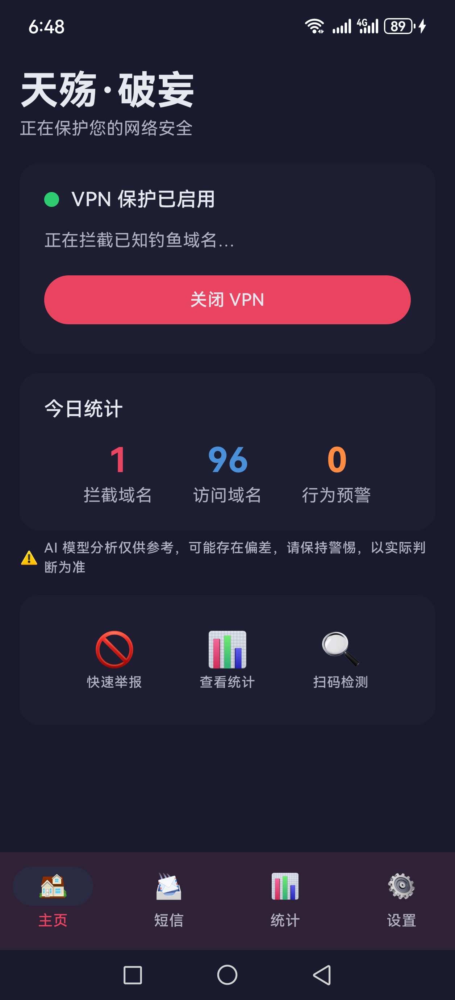
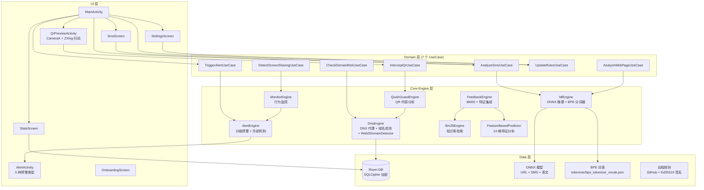
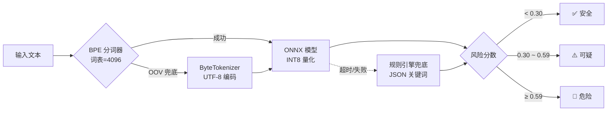
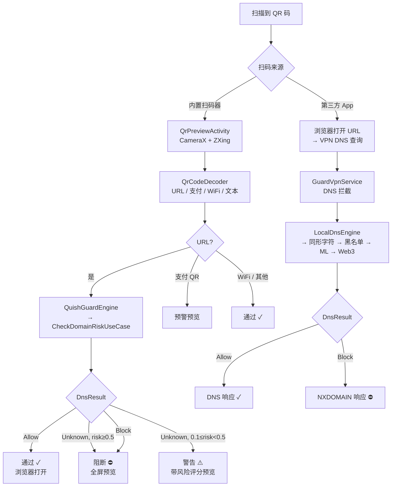
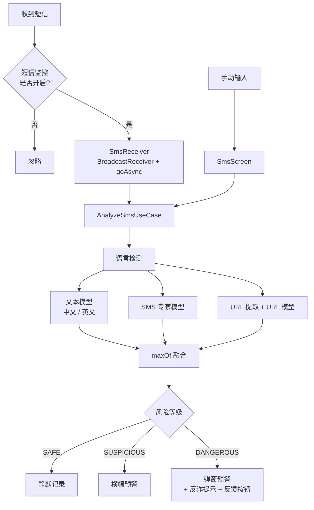

# TianshangGuard（天殇·破妄）

> **如果能少一人受骗，这个项目就有意义。**

[](https://github.com/Tianshang301/TianshangGuard/actions)
[](LICENSE)
[](https://developer.android.com/about/versions/oreo)
[](https://kotlinlang.org)


开源 Android 反诈工具，采用分层防御架构，**所有分析在设备本地完成，零数据上传**。

<p align="center">
  
</p>

[English](../README.md)

---

## 功能特性

| 功能 | 说明 |
|------|------|
| **DNS 域名拦截** | Bloom Filter 快速过滤 + 同形字符检测（西里尔/希腊/全角/亚美尼亚） |
| **网页钓鱼检测** | Byte-level Transformer 端侧推理（ONNX Runtime + NNAPI） |
| **短信诈骗检测** | SMS 模型处理中英文短信，URL 模型分析嵌入链接 — 端侧推理，动态模型选择 |
| **QR 码钓鱼拦截** | 内置 ZXing 扫码器 + CameraX 预览 + DNS 引擎实时 URL 风险分析 |
| **Web3 域名检测** | ENS `.eth`、Unstoppable `.crypto`、SID `.bnb` — 纯规则检测，无需 ML |
| **BPE 子词分词器** | 基于词表的子词分词器，ByteTokenizer 兜底 — 更好的中文处理能力 |
| **行为监控** | 检测屏幕共享 + 银行应用组合，基于 UsageStatsManager、进程 UID 身份校验与 API 34+ MediaProjection 信号，阻断社会工程学攻击 |
| **分级预警** | 静默记录 → 横幅提示 → 弹窗确认 → 全屏阻断，含冷却和频率限制 |
| **反馈引擎** | 用户标记（钓鱼/误报）融入 BM25 检索和特征预测，实现自适应检测 |
| **BM25 知识库** | 预计算反诈教育内容检索索引 |
| **特征预测** | 24 维特征提取 + 在线预测 + 自适应阈值校准 |
| **规则更新** | 远程拉取黑白名单，**Ed25519 公钥签名验证**（防重放、规范化负载） |
| **数据库加密** | SQLCipher + Android Keystore（StrongBox/TEE），原生库不可用时 **fail-closed** 内存回退，迁移旧文件安全擦除 |
| **DNS 隐私** | DNS over HTTPS（Cloudflare + AliDNS 双端点）+ 证书锁定，**fail-closed（无明文 UDP 降级）** |
| **电池优化** | 7 大品牌（华为/小米/OPPO/vivo/魅族/三星/荣耀）自动适配 |
| **多语言支持** | 中文（zh）、英文（en）、统一版（自动检测）三种构建变体 |

---

## v1.5.0 更新内容

### QuishGuard — QR 码钓鱼拦截
- **内置 QR 扫码器**：基于 CameraX + ZXing Core 的扫码页面
- **扫码前风险预览**：扫码后 URL 先经 DNS 引擎分析再决定是否打开浏览器
- **三级决策**：通过（安全 URL）→ 预警预览（可疑）→ 阻断预览（危险）
- **快捷设置磁贴**：从通知栏一键打开扫码器
- **分层防护**：主动防护（内置扫码器）+ 被动防护（VPN DNS 阻断）

### Web3Guard — 区块链域名检测
- **ENS 检测**：识别 `.eth` 域名，通过以太坊名称服务解析
- **Unstoppable Domains**：检测 `.crypto`、`.nft`、`.blockchain` 等去中心化域名
- **SID（Space ID）**：检测 `.bnb`、`.arb` 等 BNB Chain 和 Arbitrum 域名
- **纯规则实现**：零 ML 依赖，轻量检测

### SMS 模型 v5 — 100% 真实数据训练
- **v5 数据集**：8,848 条真实中文 SMS（50/50 平衡）— 清洗后 FBS（6,948）+ mudou_spam + mudou_ham（1,900）
- **30 轮训练**：BytePhishingTransformer（120K 参数），FocalLoss(alpha=0.75, gamma=2.0)，batch=64
- **校准阈值**：SAFE < 0.30，SUSPICIOUS 0.30–0.59，DANGEROUS ≥ 0.59（v5 验证集：AUC=0.9672，F1=0.9206）
- **无合成数据**：仅使用真实 FBS + mudou SMS 数据训练，无模板生成钓鱼样本

### 安全基础设施
- **数据库加密**：SQLCipher v4.5.4 + Android Keystore AES-GCM 密码保护（StrongBox/TEE）
- **Fail-closed 加密**：SQLCipher 原生库不可用时，数据回退到易失性**内存库**并展示 UI 警告（绝不落盘明文）
- **自动迁移**：首次启动时明文字库透明迁移至加密格式；旧明文文件删除前先**安全覆写**
- **Ed25519 规则签名**：远程规则更新以内嵌公钥验签（规范化负载、时间戳 + 防重放）
- **安全模块测试**：6 个 androidTest 覆盖加密、解密、持久化、迁移、篡改检测

### 安全审计修复（2026-08）

2026-08-28 全维度源码安全审计发现 20 项问题（3 Critical / 7 High / 6 Medium / 4 Low），已在 `main` 全部修复：

- **C-01** — 无密钥 SHA-256 规则"签名" → **Ed25519 公钥验签**，规范化负载 + 防重放
- **C-02** — DoH 明文 UDP 降级 → **fail-closed**（多端点 DoH，失败返回 SERVFAIL，DNS 响应问题节校验）
- **C-03** — SQLCipher 静默明文回退 → **fail-closed** 易失性内存库 + UI 警告
- **H-01..H-07** — 按模型独立 ML 回退、VPN 有界并发 + 限流、规则/过滤器同步、StrongBox/TEE 密钥、多 SPKI 证书固定、release R8 混淆 + lint、CI Actions SHA 固定 + 最小权限
- **M-01..M-06** — 同形字品牌感知检测、Web3 注册域解析、屏幕共享 UID/MediaProjection 信号、反馈 SHA-256 哈希、训练脚本加固（`weights_only`、回环 + token 鉴权）、wrapper SHA-256 + 备份排除
- **L-01..L-04** — 纯 DoH 保活、访问记录留存开关 + 30 天清理、URL 规范化修复、死代码移除

### Bug 修复与稳定性
- **59 个安全审计问题识别**：修复 26 个 P0/P1（12 Critical + 14 High），33 个 P2 延至 v1.6.0
- **CIPHER_HOOK 统一**：所有 SQLCipher 数据库连接使用一致的加密参数
- **CIPHER_HOOK 不匹配修复**：测试辅助函数和生产代码共享同一 `SQLiteDatabaseHook`，消除 "file is not a database" 错误
- **迁移引擎重写**：用 Android SQLite 读取 + Room DAOs 写入的管道替代不可用的 `sqlcipher_export()`
- **篡改检测测试**：新增 `withTimeout(5000)` 健壮测试，防止 SQLCipher 在损坏文件上阻塞
- **测试隔离**：所有安全测试使用 UUID 唯一数据库名，避免跨测试污染
- **26/26 androidTest 全部通过**（华为 ADY-AL00 真机验证）

### 技术报告
- [v1.5.0 SMS 反诈模型训练报告](docs/v1.5.0_report.tex) — LaTeX 技术报告，涵盖数据构建、30 epoch 训练、ONNX 量化、阈值校准（AUC=0.9672, 阈值0.59时F1=0.9206）及手动测试覆盖盲区分析

---

## 技术架构


```mermaid
graph TB
    subgraph Presentation["UI 层"]
        A[MainActivity] --> B[SmsScreen]
        A --> C[StatsScreen]
        A --> D[SettingsScreen]
        A --> Qr[QrPreviewActivity<br/>CameraX + ZXing 扫码]
        F[AlertActivity<br/>5 种预警类型]
        G[OnboardingScreen]
    end

    subgraph Domain["Domain 层 (7 个 UseCase)"]
        H[AnalyzeSmsUseCase]
        I[AnalyzeWebPageUseCase]
        J[CheckDomainRiskUseCase]
        K[TriggerAlertUseCase]
        L[DetectScreenSharingUseCase]
        M[UpdateRulesUseCase]
        N[InterceptQrUseCase]
    end

    subgraph Core["Core Engine 层"]
        O[DnsEngine<br/>DNS 代理 + 域名检测<br/>+ Web3DomainDetector]
        P[MlEngine<br/>ONNX 推理 + BPE 分词器]
        Q[MonitorEngine<br/>行为监控]
        R[AlertEngine<br/>分级预警 + 冷却机制]
        S[FeedbackEngine<br/>BM25 + 特征集成]
        T[Bm25Engine<br/>知识库检索]
        U[FeatureBasedPredictor<br/>24 维特征分析]
        V[QuishGuardEngine<br/>QR 内容分析]
    end

    subgraph Data["Data 层"]
        W[(Room DB<br/>SQLCipher 加密)]
        X[ONNX 模型<br/>URL + SMS + 英文]
        Y[BPE 词表<br/>tokenizer/bpe_tokenizer_vocab.json]
        Z[远程规则<br/>GitHub + Ed25519 签名]
    end

    A --> H
    A --> K
    A --> M
    B --> H
    C --> W
    D --> M
    Qr --> N
    H --> P
    I --> P
    J --> O
    K --> R
    L --> Q
    N --> V
    V --> O
    O --> W
    P --> X
    P --> Y
    Q --> R
    R --> F
    S --> T
    S --> U
```

### ML 推理流程


```mermaid
flowchart LR
    A[输入文本] --> B{BPE 分词器<br/>词表=4096}
    B -->|成功| C[ONNX 模型<br/>INT8 量化]
    B -->|OOV 兜底| D[ByteTokenizer<br/>UTF-8 编码]
    D --> C
    C --> E{风险分数}
    E -->|< 0.30| F[✅ 安全]
    E -->|0.30 ~ 0.59| G[⚠️ 可疑]
    E -->|≥ 0.59| H[🚨 危险]
    C -.->|超时/失败| I[规则引擎兜底<br/>JSON 关键词]
    I --> E
```

### QR 码扫描与防护流程


```mermaid
flowchart TD
    A[扫描到 QR 码] --> B{扫码来源}
    B -->|内置扫码器| C[QrPreviewActivity<br/>CameraX + ZXing]
    B -->|第三方 App| D[浏览器打开 URL<br/>→ VPN DNS 查询]
    C --> E[QrCodeDecoder<br/>URL / 支付 / WiFi / 文本]
    E --> F{URL?}
    F -->|是| G[QuishGuardEngine<br/>→ CheckDomainRiskUseCase]
    G --> H{DnsResult}
    H -->|Allow| I[通过 ✓<br/>浏览器打开]
    H -->|Unknown, risk≥0.5| J[阻断 ⛔<br/>全屏预览]
    H -->|Unknown, 0.1≤risk<0.5| K[警告 ⚠️<br/>带风险评分预览]
    H -->|Block| J
    F -->|支付 QR| L[预警预览]
    F -->|WiFi / 其他| M[通过 ✓]

    D --> N[GuardVpnService<br/>DNS 拦截]
    N --> O[LocalDnsEngine<br/>→ 同形字符 → 黑名单 → ML → Web3]
    O --> P{DnsResult}
    P -->|Allow| Q[DNS 响应 ✓]
    P -->|Block| R[NXDOMAIN 响应 ⛔]
```

### 短信检测流程


```mermaid
flowchart TD
    A[收到短信] --> B{短信监控<br/>是否开启?}
    B -->|否| C[忽略]
    B -->|是| D[SmsReceiver<br/>BroadcastReceiver + goAsync]
    D --> E[AnalyzeSmsUseCase]
    E --> F[语言检测]
    F --> G[文本模型<br/>中文 / 英文]
    F --> H[SMS 专家模型]
    F --> I[URL 提取 + URL 模型]
    G --> J[maxOf 融合]
    H --> J
    I --> J
    J --> K{风险等级}
    K -->|SAFE| L[静默记录]
    K -->|SUSPICIOUS| M[横幅预警]
    K -->|DANGEROUS| N[弹窗预警<br/>+ 反诈提示 + 反馈按钮]

    O[手动输入] --> P[SmsScreen]
    P --> E
```

---

## 快速开始

### 环境要求

- **JDK**: 17
- **Android SDK**: 35（compileSdk）
- **Gradle**: 8.x（项目自带 wrapper）
- **设备**: Android 8.0+（API 26）

### 构建

```bash
# 克隆仓库
git clone https://github.com/Tianshang301/TianshangGuard.git
cd TianshangGuard

# 构建中文版（推荐）
./gradlew assembleZhRelease

# 构建英文版
./gradlew assembleEnRelease

# 构建统一版（自动检测语言）
./gradlew assembleUnifiedRelease

# 安装到设备
adb install app/build/outputs/apk/zh/release/app-zh-release.apk
```

### 下载

| 版本 | 语言 | 包含模型 | 状态 |
|------|------|----------|------|
| [v1.5.0](https://github.com/Tianshang301/TianshangGuard/releases/tag/v1.5.0) | 自动检测（设置中可切换语言） | URL + SMS + 中文 + 英文 | ✅ 已发布 |
| 源码构建（zh） | 中文 UI | URL + SMS | 使用 `./gradlew assembleZhRelease` 构建 |
| 源码构建（en） | 英文 UI | URL + 英文 | 使用 `./gradlew assembleEnRelease` 构建 |

---

## 模型训练

项目包含 BytePhishingTransformer 模型：

| 模型 | 文件 | 大小 | 参数量 | 训练数据 | 性能 |
|------|------|------|--------|----------|------|
| URL 检测 | url_phishing.onnx | 319 KB | 120,321 | PhiUSIIL（23.5 万条，路径无关增强） | AUC=0.9942 |
| SMS 诈骗 | sms_phishing.onnx | 319 KB | 120,321 | v5 真实 SMS：清洗后 FBS（6,948）+ mudou（1,900），50/50 平衡 | AUC=0.9672，阈值 0.59 时 F1=0.9206 |
| 中文文本 | chinese_phishing.onnx | 319 KB | 120,321 | ChiFraud（8.2 万条清洗 + 平衡） | AUC=0.9492 |
| 英文文本 | english_phishing.onnx | 319 KB | 120,321 | UCI + NCSU + IMC25 | 待测试 |
| PhishTector 旧版 | phishing_detector_quant.onnx | 1022 KB | 644,865 | ChiFraud（FP32，64.5 万参数，历史版本） | 历史 |

### 超参数

| 超参数 | URL/SMS/EN 模型 |
|--------|----------------|
| d_model | 64 |
| n_heads | 2 |
| n_layers | 2 |
| d_ff | 128 |
| max_seq_len | 512 |
| vocab_size | 256 |
| 分词器 | BPE（词表=4096）+ Byte 兜底 |

### 训练命令

```bash
cd scripts

# 训练 URL 模型
python train_phishing_model.py --mode url

# 训练 SMS 模型
python train_phishing_model.py --mode sms

# 训练英文模型
python train_phishing_model.py --mode english

# 训练 BPE 分词器
python train_bpe_tokenizer.py

# SMS 模型知识蒸馏
python distill_sms_model.py

# 回译数据增强
python backtranslate_augment.py --input raw_data/chifraud/ --output raw_data/augmented/

# ONNX 导出 + 校准
python export_and_calibrate.py
```

训练完成后，模型自动导出为 ONNX INT8 量化版本并复制到 `app/src/main/assets/model/`。

### 阈值校准

基于 v5 验证集（885 条真实 SMS，AUC=0.9672）校准：

```bash
python calibrate_sms_threshold.py
```

当前部署阈值：
- **SAFE**: 分数 < 0.30
- **SUSPICIOUS**: 0.30 – 0.59（静默标记区，可捕获约 92.9% 钓鱼，FPR 8.7%）
- **DANGEROUS**: ≥ 0.59（Recall=92.9%，FPR=8.7%，F1=0.9206）

> `RiskLevel.toScore()` 将离散等级映射为连续中点值（SAFE→0.25，SUSPICIOUS→0.70，DANGEROUS→0.95），避免边界值升级问题。

### 评估

```bash
# 验证 ONNX 推理
python test_onnx_models.py

# 模型诊断
python diagnose_model.py

# 拟合检查
python check_fitting.py
```

---

## 项目结构

```
TianshangGuard/
├── app/src/
│   ├── main/
│   │   ├── java/com/tianshang/guard/
│   │   │   ├── core/
│   │   │   │   ├── dns/           # DNS 引擎、同形字符检测、Bloom Filter、BK-tree、DoH、Web3DomainDetector
│   │   │   │   ├── ml/            # 推理引擎、BPE 分词器、Byte 分词器、规则引擎、InputSanitizer
│   │   │   │   ├── monitor/       # 行为监控（屏幕共享检测）
│   │   │   │   ├── alert/         # 分级预警、冷却管理
│   │   │   │   ├── feedback/      # 反馈引擎（BM25 + 特征集成）
│   │   │   │   ├── retrieval/     # BM25 检索、知识库
│   │   │   │   ├── rl/            # 特征提取（24维）、特征预测
│   │   │   │   ├── calibration/   # 自适应阈值校准
│   │   │   │   ├── update/        # 规则更新（Ed25519 签名验证）
│   │   │   │   ├── optimizer/     # 电池优化（7 品牌）
│   │   │   │   ├── quish/         # QuishGuardEngine、QrCodeDecoder（ZXing QR 分析）
│   │   │   │   ├── telemetry/     # 性能追踪
│   │   │   │   └── util/          # 安全日志、语言助手
│   │   │   ├── data/
│   │   │   │   ├── local/
│   │   │   │   │   ├── database/   # GuardDatabase (Room), DAO, Entity
│   │   │   │   │   ├── security/   # EncryptedDatabaseProvider (SQLCipher)
│   │   │   │   │   └── GuardPreferences.kt (DataStore)
│   │   │   │   ├── remote/        # GitHub 规则 API
│   │   │   │   └── repository/    # 数据仓库
│   │   │   ├── domain/            # 7 个 UseCase（新增 InterceptQrUseCase）
│   │   │   ├── service/           # VPN 服务（DoH）、前台服务、开机启动、短信接收、QrScanTileService
│   │   │   ├── ui/                # Compose UI（主页、短信、统计、设置、预警、扫码、引导、主题）
│   │   │   └── di/                # Koin 依赖注入
│   │   ├── assets/
│   │   │   ├── model/             # 5 个 ONNX 模型文件（+1 自动备份）
│   │   │   ├── tokenizer/         # BPE 词表
│   │   │   ├── knowledge_base/    # BM25 预计算索引
│   │   │   ├── rules/             # 内置黑白名单和关键词规则
│   │   │   └── test_data/         # 测试用例数据
│   │   └── res/
│   ├── zh/                        # 中文变体
│   ├── en/                        # 英文变体
│   ├── unified/                   # 统一版变体（自动检测语言）
│   ├── test/                      # 单元测试（23 个文件，175 个测试）
│   └── androidTest/               # 插装测试（4 个文件，26 个测试）
├── scripts/
│   ├── train_phishing_model.py    # 主训练脚本
│   ├── train_bpe_tokenizer.py     # BPE 分词器训练
│   ├── distill_sms_model.py       # SMS 模型知识蒸馏
│   ├── backtranslate_augment.py   # 回译数据增强
│   ├── build_bm25_index.py        # BM25 索引构建
│   ├── calibrate_sms_threshold.py # SMS 阈值校准
│   ├── export_and_calibrate.py    # ONNX 导出 + 校准
│   └── raw_data/                  # 训练数据集
└── .github/workflows/
    ├── ci.yml                     # CI: 单元测试
    └── build.yml                  # 构建: APK 构建（3 种变体）
```

---

## 隐私与安全

### 核心承诺

- **纯本地分析**：所有推理通过 ONNX Runtime + NNAPI 硬件加速在设备端完成
- **数据库加密**：SQLCipher + Android Keystore（StrongBox/TEE）保护所有本地数据；原生库不可用时 fail-closed 内存回退；迁移旧明文文件安全擦除
- **DNS 隐私**：DNS over HTTPS（Cloudflare + AliDNS 双端点）+ 证书锁定，fail-closed（无明文 UDP 降级，失败返回 SERVFAIL）
- **规则完整性**：**Ed25519 公钥签名验证**（规范化负载 + 时间戳/防重放；未签名或被篡改的更新一律拒绝）
- **反馈隐私**：用户标记仅本地存储，不上传
- **特征分析本地**：24 维特征分析全部在设备端完成
- **开源可审计**：代码完全公开，接受社区审查
- **最小权限**：仅请求必要权限，用户可逐项控制

### 权限声明

| 权限 | 用途 |
|------|------|
| `BIND_VPN_SERVICE` ⚡ | VPN 拦截阻断 — 以 `<service android:permission>` 属性声明 |
| `INTERNET` | DNS over HTTPS、GitHub 规则更新 |
| `SYSTEM_ALERT_WINDOW` | 钓鱼预警悬浮窗 |
| `PACKAGE_USAGE_STATS` | 屏幕共享 + 银行应用检测 |
| `RECEIVE_SMS` + `READ_SMS` | 短信钓鱼分析 |
| `CAMERA` + `FOREGROUND_SERVICE_CAMERA` | QR 码扫描（v1.5.0 新增） |
| `RECEIVE_BOOT_COMPLETED` | 开机自启防护 |
| `FOREGROUND_SERVICE` | 前台保活 |
| `FOREGROUND_SERVICE_DATA_SYNC` | Android 14+ 前台服务类型声明 |
| `REQUEST_IGNORE_BATTERY_OPTIMIZATIONS` | 防止电池优化杀死服务 |
| `ACCESS_NETWORK_STATE` | DoH 网络连通性检查 |
| `VIBRATE` | 危险级别预警震动 |

### 能力边界

**能防护**：
- 已知钓鱼域名访问
- 仿冒域名（视觉混淆、同形字符、音译混淆）
- 短信中的钓鱼话术和诈骗关键词（中文、英文）
- 屏幕共享 + 银行应用组合的高风险操作
- 网页内容中的钓鱼话术
- 含恶意 URL 的短信
- QR 码中的钓鱼 URL（内置扫码器 + VPN DNS 双层防护）

**不能防护**：
- 用户主动绕过保护（社会工程学核心难题）
- 电话诈骗（无网络流量特征）
- 零日钓鱼域名（未被收录）
- 加密通信内容（微信、银行 App 内 WebView）

---

## 测试

### 单元测试（23 个文件，175 个测试）

| 测试文件 | 用例数 | 覆盖范围 |
|----------|--------|----------|
| `RuleBasedEngineTest.kt` | 8 | 关键词匹配逻辑 |
| `HomographDetectorTest.kt` | 16 | 同形字符检测 + 拼音混淆 + 品牌感知 `assess()` |
| `AdaptiveBloomFilterTest.kt` | 8 | Bloom 过滤器正确性 |
| `CooldownManagerTest.kt` | 6 | 预警冷却逻辑 |
| `BkTreeTest.kt` | 10 | BK-tree 操作 |
| `DnsPacketHandlerTest.kt` | 15 | DNS 报文解析 + 响应校验 |
| `DohClientTest.kt` | 2 | DoH 客户端 |
| `BpeTokenizerTest.kt` | 9 | BPE 分词器 |
| `ByteTokenizerTest.kt` | 9 | Byte 分词器 |
| `OnnxMlEngineTest.kt` | 10 | ONNX 引擎 |
| `OnnxMlEngineSpikeTest.kt` | 4 | ONNX 集成 |
| `FeatureExtractorTest.kt` | 23 | 特征提取 |
| `Bm25EngineTest.kt` | 8 | BM25 检索 |
| `PerformanceTracerTest.kt` | 5 | 性能指标 |
| `SignatureVerifierTest.kt` | 6 | Ed25519 签名验证 |
| `FeedbackEngineTokenizerTest.kt` | 7 | 反馈分词 |
| `GuardPreferencesTest.kt` | 1 | DataStore 偏好 |
| `RuleRepositoryTest.kt` | 8 | 规则仓库 |
| `RuleUpdateInteractorTest.kt` | 8 | 规则更新交互（签名 + 防重放） |
| `AnalyzeSmsUseCaseTest.kt` | 6 | 短信分析用例 |
| `AnalyzeWebPageUseCaseTest.kt` | 2 | 网页分析 |
| `CheckDomainRiskUseCaseTest.kt` | 3 | 域名风险检查 |
| `UpdateRulesUseCaseTest.kt` | 1 | 规则更新 |

### Android 插装测试（26 个测试）

| 测试类 | 用例数 | 状态 |
|--------|--------|------|
| `AlertDaoTest` | 5 | ✅ 通过 |
| `DomainDaoTest` | 6 | ✅ 通过 |
| `GuardPreferencesTest` | 9 | ✅ 通过 |
| `SecurityModuleTest` | 6 | ✅ 通过（SQLCipher 加密、迁移、篡改检测、Keystore） |

### 测试数据（assets/test_data/）

| 文件 | 用例数 | 覆盖范围 |
|------|--------|----------|
| `sms_test_cases.json` | 41 | 钓鱼 + 正常 + 英文短信 |
| `domain_test_cases.json` | 27 | 白名单、黑名单、同形字符、Punycode、可疑、未知 |
| `feedback_test_cases.json` | 10 | 误报 + 钓鱼场景 |
| `alert_test_cases.json` | 10 | 6 种预警类型 |
| `feature_test_cases.json` | 14 | 14 个特征维度 |

---

## 贡献指南

```bash
# 1. Fork 仓库
# 2. 创建特性分支
git checkout -b feature/your-feature

# 3. 提交更改
git commit -m "Add your feature"

# 4. 推送分支
git push origin feature/your-feature

# 5. 创建 Pull Request
```

### 规则贡献

提交可疑域名到 `rules/community/` 目录，JSON 格式：

```json
{
  "domain": "example.com",
  "reason": "phishing",
  "source": "user_report"
}
```

---

## 致谢

- [PhiUSIIL](https://www.kaggle.com/datasets/shashwatwork/phiusiil-phishing-url-dataset) — URL 钓鱼数据集
- [ChiFraud](https://github.com/xuemingxxx/ChiFraud) — 中文欺诈短信数据集
- [FBS SMS](https://github.com/Cypher-Z/FBS_SMS_Dataset) — 伪基站短信数据集 (CCS'20)
- [mudou_spam](https://huggingface.co/datasets/shaonianruntu/Spam-Message-Classification) — 中文短信分类数据集（垃圾 + 正常）
- [ONNX Runtime](https://onnxruntime.ai/) — 端侧推理引擎
- [PhishTank](https://www.phishtank.com/) — 钓鱼域名情报
- [SQLCipher](https://www.zetetic.net/sqlcipher/) — 数据库加密引擎
- [CameraX](https://developer.android.com/training/camerax) — 相机 API（QR 扫描）
- [ZXing](https://github.com/zxing/zxing) — QR 码解码库

---

## License

[MIT](../LICENSE) © Tianshang301
